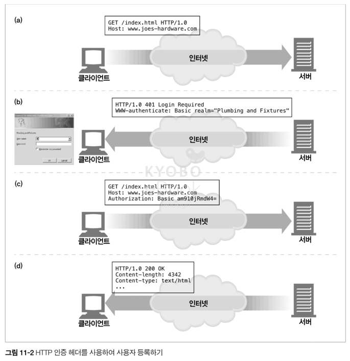

# 11장. 클라이언트 식별과 쿠키
> 서버가 통신하는 대상을 식별하는 데 사용되는 기술을 알아보자.


## 상태가 없는 HTTP 트랜잭션
`HTTP`는 익명으로 사용하며 **상태가 없고** 요청과 응답으로 통신하는 프로토콜이다.

> 상태가 없다 또는 무상태(stateless)의 의미  
> : 연결 자체에 대한 정보를 가지지 않으며, 매 요청은 **일회성**이고 **독립적**으로 처리된다.


현대의 웹 사이트들은 네트워크로 연결된 사용자들에 대해 더 많은 것을 알고 싶어 하고,
사용자들이 브라우징하는 것을 기록하여, **개인화된 서비스**를 제공하고 싶어 한다.

> 개인화된 서비스 예  
> - 개별 인사 : 사용자에게 특화된 환영 메시지, 페이지 내용 제공
> - 사용자 맞춤 추천 : 고객의 흥미가 무엇인지 학습해서 고객이 좋아할 것이라 예상되는 제품 추천
> - 사용자 정보 저장 : 온라인 쇼핑 고객의 경우, 주소나 신용카드 정보 매번 입력하지 않고 저장
> - 세션 추적 : 상태가 없는 HTTP 트랜잭션을 식별하여 상태 유지 (ex. 쇼핑몰 장바구니)

  
개인화된 서비스를 제공하려면, 사용자가 사이트와 상호작용할 수 있게 **사용자의 상태를 남겨야 한다.** 

이렇게 상태를 유지하려면, 웹 사이트는 **각 사용자에게서 오는 `HTTP` 트랜잭션을 식별할 방법이 필요**하다.

> 사용자 식별 기술 종류
> - 사용자 식별 관련 정보를 제공하는 `HTTP` 헤더들
> - 클라이언트 `IP` 주소 추적으로 알아낸 `IP` 주소로 사용자 식별
> - 사용자 로그인 인증을 통한 사용자 식별
> - `URL`에 식별자 포함하는 기술인 `뚱뚱한(fat) URL`
> - 식별 정보를 지속해서 유지하는 강력하면서도 효율적인 기술인 `쿠키`

위 사용자 식별 기술을 하나하나 살펴보자.


## 사용자 식별 기술
### 1. HTTP 헤더
> 1. **`From` 헤더** : 사용자의 이메일 주소를 서버에게 제공  
> (악의적인 서버가 스팸 메일 발송하는 문제 때문에 요즘 From 헤더 보내는 브라우저 많지 않음)


> 2. **`User-Agent`** 헤더 : 사용자가 쓰는 브라우저 이름, 버전 정보, 운영체제 정보를 서버에게 제공  
> (특정 브라우저에서 제대로 동작하도록 서비스 최적화할 순 있지만, 특정 유저 식별에는 도움 X)

> 3. **`Referer`** 헤더 : 사용자가 현재 페이지로 유입하게 한 웹페이지의 `URL` 제공
> (사용자의 취향 파악 가능)


### 2. 클라이언트 IP 주소
결론부터 말하면, 클라이언트의 IP 주소로 사용자를 식별하려는 방법은 초기에 사용되었으나,
이 방식은 제대로 동작하지 않기 때문에 사용하지 않는다.
그 이유는 다음과 같다.

- `클라이언트 IP`는 **사용자가 아닌, 사용하는 컴퓨터를 카리킴.** 즉, 여러 사용자가 하나의 컴퓨터 사용하면, 각 사용자 식별 불가
- 많은 인터넷 서비스 제공자(`ISP`)는 사용자 로그인할 때마다 **동적으로 `IP` 주소 할당함.** 즉, 사용자는 매번 다른 주소 받으므로, 웹 서버가 사용자 식별 불가
- 현재 많은 사용자가 보안을 위해 `NAT(네트워크 주소 변환 방화벽, Network Address Translation)` 장비 사용. `NAT`는 **클라이언트의 실제 `IP` 주소를 방화벽 뒤로 숨기고, 클라이언트의 실제 `IP` 주소를 사용하는 방화벽 `IP` 주소로 변환**함
- 보통, `HTTP` 프락시와 게이트웨이는 서버에 새로운 `TCP` 연결을 하므로, 서버는 클라이언트의 `IP` 주소가 아니라 프락시 서버의 `IP` 주소를 보게 됨

### 3. 사용자 로그인


위 그림처럼 `HTTP`는 `WWW-Authenticate`와 `Authorization 헤더`를 사용해 사용자에게 로그인을 요구할 수 있다.

- (a) 브라우저가 `www.joes-hardware.com` 사이트로 요청
- (b) 사이트는 사용자의 식별 정보 알지 못하므로, `401 Login Required HTTP` 응답 코드와 `WWW-Authenticate` 헤더 반환하여 로그인 요청. 브라우저에는 로그인 상자 뜸
- (c) 사용자가 이름, 비밀번호 입력 후 기존 요청 다시 보냄
- (d) 이제 서버는 사용자의 식별정보 알기 때문에 정상적인 응답 전달(`200 OK`)

> 하지만 로그인으로 사용자를 식별하는 방법은 **사이트 옮겨다닐 때마다 각 사이트에 로그인 해야 하므로 매우 귀찮은 방식**이다.


### 4. 뚱뚱한 URL
뚱뚱한 URL은 URL 경로의 처음이나 끝에 사용자의 상태 정보를 추가해 사용자를 식별하는 방법이다.

**뚱뚱한 URL의 문제점**
- 못생긴 URL: 브라우저에 보이는 복잡한 URL은 사용자들에게 혼란을 줌
- 공유하지 못하는 URL: 뚱뚱한 URL이 공유되면 개인 정보를 공유하는 것이나 다름 없음 (보안 문제)
- 캐시를 사용할 수 없음: URL이 달라지기 때문에 기존 캐시에 접근 불가
- 서버 부하 가중 : 뚱뚱한 URL로 변환되며 서버는 HTML 페이지 다시 그려야 함
- 이탈: 사용자가 뚱뚱한 URL 세션에서 이탈하면, 지금까지의 진척사항들 초기화되고 다시 처음부터 시작해야 함
- 세션 간 지속성의 부재: 로그아웃하면 모든 정보 잃음


### 5. 쿠키
현재 가장 널리 사용하는 방식

#### 5.1 쿠키의 타입
> **세션 쿠키(`Session Cookie`)** : 사용자가 사이트 탐색할 때, 관련 설정과 선호 사항 저장하는 임시 쿠키로, 브라우저 닫으면 삭제됨
  
> **지속 쿠키(`Persistent Cookie`)** : 브라우저 닫거나 컴퓨터 재시작하더라도 남아있는 쿠키
  
세션 쿠키와 지속 쿠키의 다른 점은 **파기되는 시점 뿐**이다.


#### 5.2 쿠키는 어떻게 동작하는가

- 서버가 해당 사용자 식별을 위해 유일한 값(Session ID)을 쿠키에 할당하여 사용자에게 전달함
- 쿠키는 임의의 `key` = `value` 형태의 리스트이며, HTTP 응답 헤더(`Set-Cookie`)에 기술되어 전달됨
- 전달된 쿠키 콘텐츠는 브라우저의 쿠키 데이터베이스에 저장됨
- 사용자가 미래에 같은 사이트를 다시 방문하면, 브라우저는 서버가 이 사용자에게 할당했던 쿠키를 `Cookie 요청 헤더`에 기술해 전송함

즉, 쿠키는 브라우저가 서버 관련 정보를 (쿠키로) 저장했다가, 사용자가 해당 서버에 접근할 때마다 그 정보(쿠키)를 함께 전송하게 하는 것이다!


#### 5.3 쿠키 상자: 클라이언트 측 상태
브라우저는 쿠키 정보를 저장할 책임이 있는데, 이를 **클라이언트 측 상태, HTTP 상태 관리 체계(`HTTP State Management Mechanism`)** 이라 한다.

각 브라우저마다 다른 방식으로 쿠키 저장한다.
- 구글 크롬 : SQLite 파일에 쿠키 저장
- 마이크로소프트 인터넷 익스플로러 : 캐시 디렉터리에 각각의 개별 파일로 쿠키 저장


#### 5.4 사이트마다 각기 다른 쿠키들
- 브라우저는 사이트에 두 개 혹은 세 개의 쿠키만 보낸다.
  - 모든 사이트에 쿠키를 모두 전달하면 성능이 크게 저하됨
  - 신뢰하지 않은 사이트에 개인정보를 전달할 위험
 
> 쿠키 Domain 속성  
> : 어떤 사이트가 해당 쿠키 읽을 수 있는지 제어하는 속성으로, 서버가 쿠키 생성 시 `Set-Cookie 응답 헤더`에 기술한다.  
> 예시: `Set-cookie: user="mary17"; domain="airtravelbargains.com"`


> 쿠키 Path 속성
> : 웹 사이트 일부에만 쿠키 적용하는 속성
> `Set-cookie: pref=compact; domain="airtravelbargains.com"; path=/autos/`

#### 5.5 쿠키 구성요소
- 쿠키 명세에는 `Version 0`쿠키(넷스케이프 쿠키)와 `Version 1`쿠키가 존재한다.
- `Version 1` 쿠키 는 널리 쓰이지는 않는다.


>  **Version 0 (넷스케이프) 쿠키**  
> `Set-Cookie` 헤더, `Cookie` 요청 헤더, 쿠키 조작에 필요한 필드 등이 정의되어 있다.
> 쿠키 옵션 속성들을 `;`으로 이어서 기술한다.

**`Set-Cookie` 헤더**
- 이름=값:	(필수 속성) 쿠키의 이름과 값을 의미
- Expires:	(선택 속성) 쿠키의 생명주기를 나타내는 날짜 문자열 [ 요일, DD-MM-YY, HH:MM:SS GMT ]
- Domain:	(선택 속성) 이 속성에 기술된 도메인을 사용하는 서버 호스트명만 쿠키를 전송한다 [ .com .edu .net .org .mil ... ] 도메인이 명시되지 않아있다면, 서버의 호스트명을 Default로 사용
- Path:	(선택 속성) 서버에 있는 특정 경로에만 쿠키를 할당
- Secure:	(선택 속성) 이 속성이 포함되어 있으면 HTTPS 연결을 사용할 때만 쿠키를 전송

> **Version 1 쿠키**  
> Set-Cookie2 헤더, Cookie2 헤더 등이 있고, 아직 모든 브라우저나 서버가 완전히 지원하지 않는다.  
> Set-Cookie2 헤더의 속성들은 Version 0 Cookie 보다 더 많이 있다.

**`Set-Cookie2` 헤더**
- 이름=값:	(필수 속성) 사용자가 추후 웹 서버에 다시 방문했을 때 되돌려 받을 수 있는 값
- Version:	(필수 속성) 쿠키 명세의 버젼을 가리키는 정수값이다 [ Version="1"; ]
- Comment:	(선택 속성) 서버가 쿠키를 사용하려는 의도를 기술한다
- CommentURL:	(선택 속성) 서버가 쿠키를 사용하려는 목적과 정책에 대해 기술된 웹페이지 링크
- Discard:	(선택 속성) 클라이언트 프로그램이 종료될 때 쿠키를 삭제하라는 헤더
- Domain:	위와 동일
- Max-Age:	(선택 속성) Expires와 목적은 유사하나, 실제 쿠키의 생명주기를 초 단위로 산정한 정수값
- Path:	위와 동일
- Port:	(선택 속성) 특정 Port에 해당하는 서버로만 쿠키를 전달
- Secure:	위와 동일

### 5.6 쿠키와 캐싱
- 쿠키를 캐싱하게 되면 이전 사용자의 쿠키가 다른 사용자에게 할당되거나, 개인 정보가 노출될 수 있게 때문에 주의가 필요하다.

#### 캐시되지 말아야 할 문서는 표시하라
- 캐시를 해도 되는 문서 : `Cache-Control: Public`
- Set-Cookie 헤더 제외하고 캐시 해도 되는 문서 : `Cache-Control: no-cache="Set-Cookie"`

#### Set-Cookie 헤더를 캐시 하는 것에 유의하라
- 응답에 `Set-Cookie` 헤더를 가지고 있으면 본문은 캐시할 수 있지만, 헤더를 캐시하는 것은 주의가 필요하다.
- `Set-Cookie` 헤더를 여러 사용자에게 보내면 사용자 추적에 실패하기 때문이다.

#### Cookie 헤더를 가지고 있는 요청을 주의하라
- 요청이 Cookie 헤더와 함께 오면, 결과 콘텐츠가 개인정보를 담고 있을 수 있다는 의미이므로 캐시에 주의를 기울여야 한다.

### 5.7 쿠키, 보안 그리고 개인정보
- 개인 정보와 같은 중요한 정보는 서버와 연결된 원격 데이터베이스에 저장하고, 해당 데이터의 키 값을 쿠키에 저장하는 방식을 사용하면 쿠키에 예민한 데이터가 담기는 것을 줄일 수 있다.

---

# 12. 기본 인증
많은 사람들이 웹으로 개인적인 업무를 보는 만큼, 권한이 있는 사람만이 데이터에 접근하고 업무를 처리할 수 있어야 한다.  
그러기 위해서는 **서버가 사용자가 누구인지 식별**할 수 있어야 한다.  
  
이를 위해 HTTP는 자체적인 인증 관련 기능을 제공한다.  
(보안을 더 강화한 요즘 웹 사이트 대부분은 HTTP 자체 인증 기능보다 인증 모듈 이용해 '직접' 구현함)


## 12.1 **인증** : 내가 누구인지 증명하는 것
### 12.1.1 HTTP의 인증요구/응답 프레임워크
- `HTTP`는 사용자 인증에 사용되는 자체적인 인증요구/응답 프레임워크를 제공한다.


- 웹 서버가 HTTP 요청을 받으면 사용자를 식별하기 위한 '인증 요구'로 응답할 수 있다.

### 12.1.2 인증 프로토콜과 헤더
- 4가지 인증 단계
|   단계    |        헤더         | 설명                                                                           | 메서드/상태      |
| :-------: | :-----------------: | :------------------------------------------------------------------------ | :--------------- |
|   요청    |                     | 첫 번째 요청에는 인증 정보가 없다.                                                        | GET              |
| 인증 요구 |  WWW-Authenticate   | 서버는 사용자 인증을 위해 사용자 이름과 비밀번호를 제시하라는 의미로 401 status code와 설명을 작성한다. | 401 Unauthorized |
|   인증    |    Authorization    | Authorization	클라이언트는 인코딩한 사용자 이름과 비밀번호를 헤더에 넣어 다시 인증 요청한다.         | GET              |
|   성공    | Authentication-info | 인증 정보가 정확하면 서버는 응답한다. 선택적으로 인증 세션에 관한 추가 정보를 기입한 헤더를 보낼 수도 있다.     | 200 OK           |


### 12.1.3 보안 영역
- 인증 요구 시 `WWW-Authenticate` 헤더에 `realm` 지시자가 서술되어 있다.
- 웹 서버는 기밀문서를 보안 영역(`realm`) 그룹으로 나누어, 각 보안 영역(리소스)마다 다른 사용자 접근 권한을 요구한다.

HTTP 응답 헤더 에서 realm을 통해 사용자에게 권한의 범위를 이해하는 데 도움을 줄 수 있다.

``` HTTP
HTTP/1.0 401 Unauthorized
WWW-Authenticate: Basic realm="Corporate Financials"
```

## 12.2 기본 인증
- 웹 서버가 `200` 대신 `401` 상태 코드로 요청을 거부하고, 클라이언트가 접근하려고 했던 보안 영역을 `WWW-Authenticate 헤더`에 기술해서 응답하여 인증을 요구한다.
- 클라이언트는 이에 맞는 인증 정보를 `Authorization 요청 헤더`안에 암호화하여 서버로 다시 보낸다.
- 서버는 `사용자 이름`과 `비밀번호`를 디코딩하고 검사한 후, 문제가 없으면 `HTTP 200 OK` 메시지와 함께 요청 받은 문서를 보낸다.


### 12.2.1 Base-64 사용자 이름/비밀번호 인코딩
- HTTP 기본 인증에서, 클라이언트가 인증 응답할 때, 사용자 이름과 비밀번호를 콜론으로 이어 합치고, base-64 인코딩 메서드를 사용해 인코딩 한다.
- 이때, base-64 인코딩은 8비트 바이트로 이루어진 시퀸스를 6비트 덩어리 시퀸스로 변환하며, 6비트 조각은 대부분 64개의 문자/숫자 중에서 선택된다.


### 12.2.2 프락시 인증
- 어떤 회사에서는 회사 서버, LAN, 무선 네트워크 접속 전에 프락시 서버를 거치게 하여 사용자를 인증한다.
- 프락시 인증은 웹 서버의 인증과 헤더와 상태 코드만 다르고 절차는 같다.

| 웹 서버 |	프락시 서버 |
| --- | ---- |
| 비인증 상태 코드: 401 |	비인증 상태 코드: 407 |
| WWW-Authenticate	| Proxy-Authenticate |
| Authorization |	Proxy-Authorization |
| Authentication-Info |	Proxy-Authentication-Info |

### 12.2.3 기본 인증의 보안 결함
> 1. base-64 로 인코딩된 사용자 이름과 비밀번호는 인코딩 절차를 반대로 수행하여 어렵지 않게 디코딩할 수 있다.

- base-64로 인코딩된 비밀번호는 사실상 '비밀번호 그대로' 보내는 것과 다름 없다.
- HTTP 트랜잭션을 SSL 암호화 채널을 통해 보내거나, 보안이 더 강화된 다이제스트 인증 프로토콜을 사용하는 게 좋다.
  
> 2. 보안 비밀번호를 디코딩이 어렵도록 인코딩해도, 여전히 그것 그대로를 원 서버에 보내면 인증에 성공하고 서버에 접속할 수 있다.
    
- 누군가 기본 인증 과정에서 사용자 이름과 비밀번호를 가로채는 상황을 대비할 수 없다는 뜻
  
> 3. 보안이 뚫려도 치명적이지 않은 애플리케이션이더라도, 수많은 사용자는 모든 사이트에 같은 아이디, 비밀번호 사용하는 경우 많으므로 이는 굉장히 위험할 수 있다.
  
> 4. 인증 과정에서 프락시나 중개자가 중간에 개입하여 메시지가 수정되는 경우, 기본 인증은 정상적인 동작을 보장하지 않는다.
  
> 6. 위장된 가짜 서버에 취약하다.
  
> 결론 : 기본 인증은 개인화나 접근을 제어하는 데 편리하며, 보안 상 안전하지 않으므로 다른 사람들이 보지 않길 원하지만, 보더라도 치명적이지 않은 경우에 유용하다
