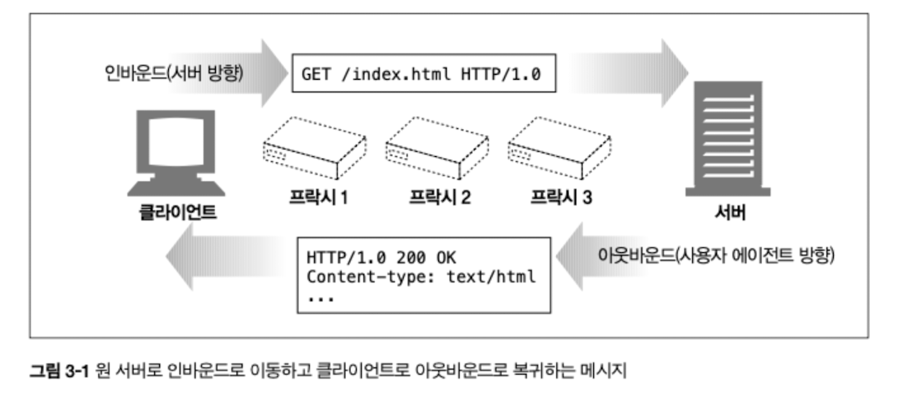
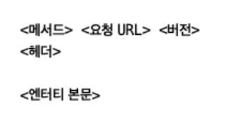
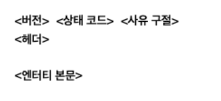
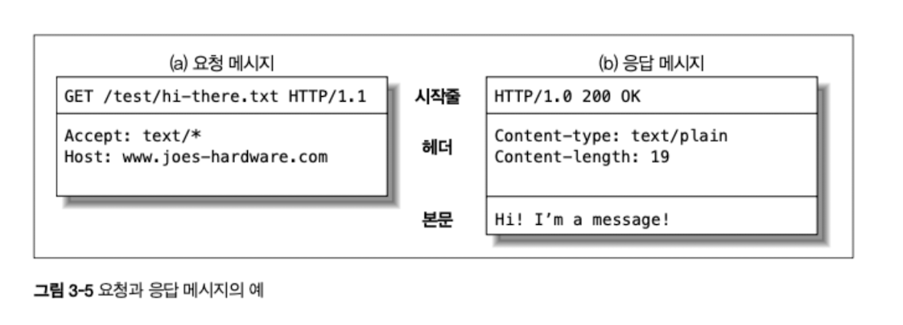
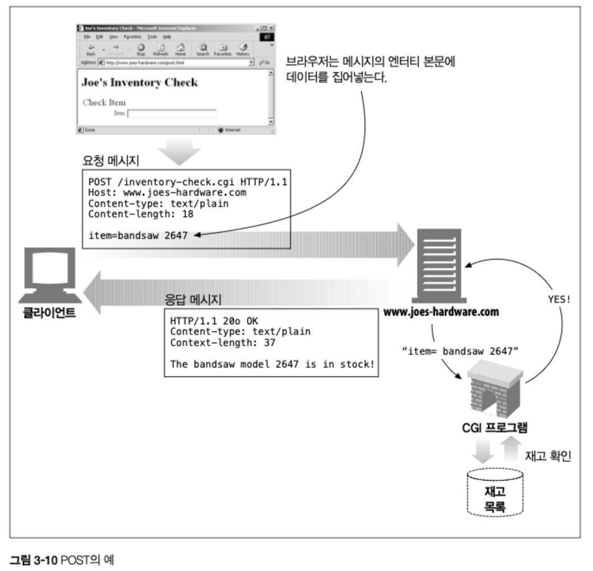
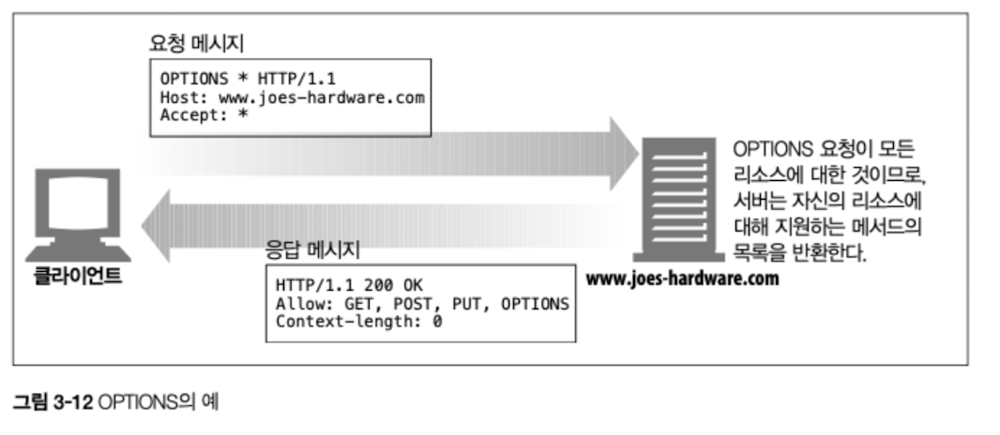
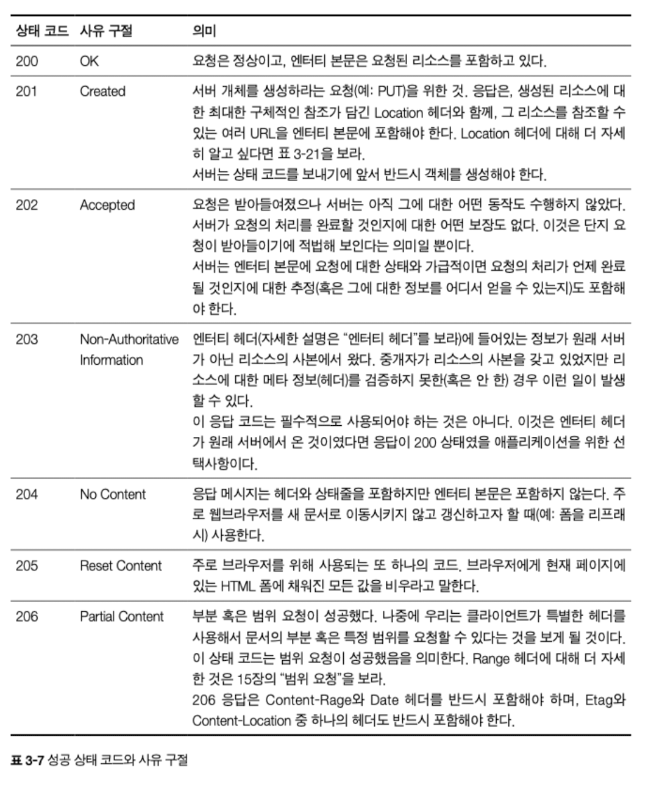
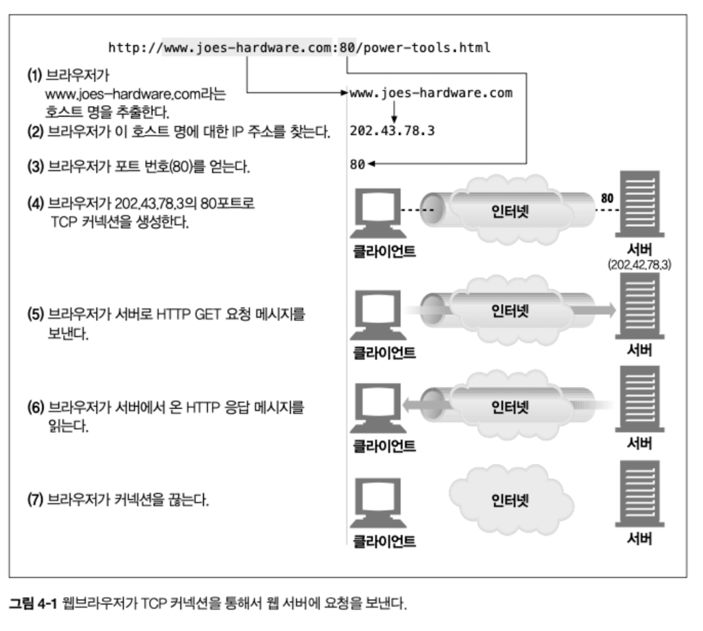
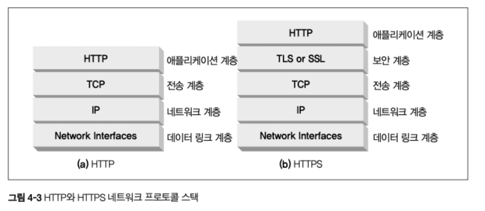
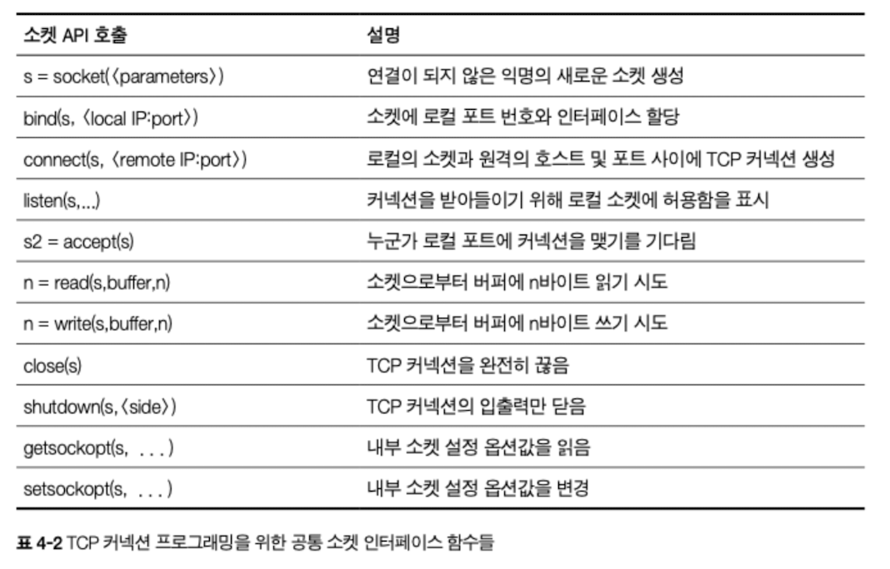

## 3장 HTTP 메세지

### 3.1 메세지의 흐름

- HTTP 메세지는 HTTP 애플리케이션 간에 주고받은 **데이터의 구조화된 블록**
- HTTP 메세지는 메시지의 내용과 의미를 설명하는 텍스트 메타 정보로 시작해서 선택적으로 데이터가 온다.
- 해당 메시지는 클라이언트, 서버, 프락시 사이를 흐른다.

#### 3.1.1 메시지는 원 서버 방향을 인바운드로 하여 송신된다.



- HTTP의 인바운드와 아웃바운드라는 용어는 트랜잭션 방향을 표현
- 인바운드 : 메세지가 원 서버로 향하는 것
- 아웃바운드 : 모든 처리가 끝난 뒤에 메시지가 사용자 에이전트로 돌아오는 것

#### 3.1.2 다운스트림으로 흐르는 메세지

- 메세지의 발송자는 수신자의 업스트림
- 메세지의 수신자는 발송자의 다운스트림

### 3.2 메세지의 각 부분

1. 메시지 구성 요소

- 메세지는 시작줄, 헤더 블록, 본문으로 이루어진다.

| 구성 요소                    | 설명                                                            |
| ---------------------------- | --------------------------------------------------------------- |
| **시작줄 (Start Line)**      | 어떤 메시지인지 서술 (요청/응답의 첫 줄)                        |
| **헤더 블록 (Header Block)** | 메시지의 속성들이 줄 단위로 나열됨                              |
| **본문 (Body)**              | 선택적 데이터 덩어리. 텍스트/이진 데이터 또는 비어 있을 수 있음 |

2. 형식적 특징

| 항목                   | 내용                                             |
| ---------------------- | ------------------------------------------------ |
| **시작줄 & 헤더 형식** | ASCII 문자열로 구성                              |
| **줄 구분 방식**       | 각 줄은 `CRLF` (`\r\n`) 로 끝남                  |
| **본문 데이터**        | 텍스트 또는 바이너리 가능, 필요에 따라 생략 가능 |

#### 3.2.1 메시지 문법

- 모든 HTTP 메시지는 요청 메시지나 응답 메시지로 분류

##### 요청 메시지 형식



##### 응답 메시지 형식



| 항목            | 내용                                                                             |
| --------------- | -------------------------------------------------------------------------------- |
| **메서드**      | 클라이언트 측에서 서버가 리소스에 대해서 수행해주길 바라는 동작(GET, POST, HEAD) |
| **요청 URL**    | 요청 대상이 되는 리소스를 지칭하는 URL 혹은 URL의 경로 구성요소                  |
| **버전**        | 이 메세지에서 사용 중인 HTTP 버전 (HTTP/<메이저>.<마이너>)                       |
| **상태코드**    | 요청 중 무엇이 일어났는 지 설명하는 세자리 숫자                                  |
| **사유 구절**   | 상태코드의 의미를 설명하는 짧은 문구                                             |
| **헤더들**      | 이름, 콜론(:), 선택적 공백, 값, CRLF가 순서대로 나타나는 0개 이상의 헤더         |
| **엔티티 본문** | 임의의 데이터 블록, 엔티티 본문이 없더라도 HTTP 헤더의 집합은 항상 CRLF로 끝남.  |



#### 3.2.2 시작줄

- 모든 HTTP 메세지는 시작줄로 시작

**요청줄**

- 서버에게 리소스에 대해 무언가를 해달라고 부탁
- 메서드와 요청 URL, HTTP 버전이 공백으로 구분

**응답줄**

- 수행 결과에 대한 상태 정보와 결과 데이터를 클라이언트에게 돌려준다.
- HTTP 버전, 상태코드, 사유 구절이 공백으로 구분

**메서드**

- 요청의 시작줄은 메서드로 시작하며, 서버에게 무엇을 해야할 지 말해준다.

| 메서드  | 설명                                                    | 메시지 본문이 있는가? |
| ------- | ------------------------------------------------------- | --------------------- |
| GET     | 서버에서 어떤 문서를 가져온다.                          | 없음                  |
| HEAD    | 서버에서 어떤 문서에 대해 헤더만 가져온다.              | 없음                  |
| POST    | 서버가 처리해야 할 데이터를 보낸다.                     | 있음                  |
| PUT     | 서버에 요청 메시지의 본문을 저장한다.                   | 있음                  |
| TRACE   | 메시지가 프락시를 거쳐 서버에 도달하는 과정을 추적한다. | 없음                  |
| OPTIONS | 서버가 어떤 메서드를 수행할 수 있는지 확인한다.         | 없음                  |
| DELETE  | 서버에서 문서를 제거한다.                               | 없음                  |

**상태코드**

- 클라이언트에게 무엇이 일어났는 지 말해준다.
- `HTTP/1.0 200 OK`에서 상태코드는 200
- 인식할 수 없는 상태 코드를 받게 되면, 현재 프로토콜의 확장으로 그것을 정의했을 가능성이 있으므로 포함되는 일반적인 범주의 구성원으로 해석한다.(5XX)

| 전체 범위 | 정의된 범위 | 분류            |
| --------- | ----------- | --------------- |
| 100-199   | 100-101     | 정보            |
| 200-299   | 200-206     | 성공            |
| 300-399   | 300-305     | 리다이렉션      |
| 400-499   | 400-415     | 클라이언트 에러 |
| 500-599   | 500-505     | 서버 에러       |

**사유 구절**

- 상태코드와 일대일 대응으로, 사람이 이해하기 쉬운 버전

**버전 번호**

- HTTP 애플리케이션들이 자신이 따르는 프로토콜의 버전을 상대방에게 말해주기 위한 수단

#### 3.2.3 헤더

- 시작줄 다음에는 여러개의 HTTP 헤더가 온다.
- HTTP 헤더 필드는 요청과 응답 메시지에 추가 정보를 더하는 이름/값 쌍의 목록

1. 헤더 분류

- HTTP 헤더 명세는 여러 헤더 필드를 정의
- 애플리케이션은 자유롭게 자신만의 헤더를 만들어낼 수 있다.

**일반 헤더**

- 요청과 응답 양쪽 모두 나타날 수 있음

**요청 헤더**

- 요청에 대한 부가 정보를 제공

**응답 헤더**

- 응답에 대한 부가 정보를 제공

**Entity 헤더**

- 본문 크기와 콘텐츠, 혹은 리소스 그 자체를 서술

**확장 헤더**

- 명세에 정의되지 않은 새로운 헤더

#### 3.2.4 엔티티 본문

- HTTP 메시지의 세번째 부분은 선택적인 엔티티 본문.
- 이미지, 비디오, HTML 문서, 소프트웨어 애플리케이션, 신용카드 트랜잭션, 전자우편 등의 디지털 데이터를 실어 나를 수 있다.

### 3.3 메서드

#### 3.3.1 안전한 메서드

- GET, HEAD 메서드를 사용하는 경우, HTTP 요청 결과로 서버에 어떤 작용도 없음을 의미.

#### 3.3.2 GET

- 서버에게 리소스를 달라고 요청하기 위해 쓰임.

#### 3.3.3 HEAD

- HEAD 메서드는 GET 처럼 동작하지만, 서버는 응답으로 헤더만을 반환
- 엔티티 본문은 반환되지 않는다.
- 리소스를 가져오지 않고도 타입이나 length 등 헤더 정보 확인 가능
- 개체가 존재하는 지 확인 가능
  리소스가 변경되었는지 확인 가능

#### 3.3.4 PUT

- 서버가 요청의 본문을 가지고 요청 URL의 이름대로 새 문서를 만들거나, 본문을 사용해서 교체하는 것

#### 3.3.5 POST

- 서버에 입력 데이터를 전송하기 위해 설계

#### 3.3.6 TRACE



- 클라이언트의 요청이 방화벽, 프락시, 게이트웨이 등의 애플리케이션을 통과하게되면 이들에게는 원래의 HTTP 요청을 수정할 수 있는 기회가 있다.
- TRACE 메서드는 클라이언트에게 클라 요청이 서버에 도달했을 때 어떻게 보이게 되는 지 알려준다.
- 요청 전송의 마지막 단계에 있는 서버는 자신이 받은 요청 메세지를 본문에 넣어 TRACE 응답을 되돌려준다.
- 주로 진단을 위해 사용되는 메서드로, 의도한 요청/응답 연쇄를 거치는 지 검사할 수 있다.

#### 3.3.7 OPTIONS



- 웹 서버에게 지원 범위에 대해 요청하는 메서드
- 특정 리소스에 대해 어떤 메서드가 지원되는 지 알 수 있다.

#### 3.3.8 DELETE

- 요청 URL로 지정한 리소스를 삭제할 것을 요청

#### 3.3.9 확장 메서드

- HTTP/1.1에 명시되지 않은 메서드로, 리소스에 대한 관리 능력을 확장할 수 있다.

| 메서드 | 설명                                                         |
| ------ | ------------------------------------------------------------ |
| LOCK   | 사용자가 리소스를 잠글 수 있게 해준다. (ex. 동시편집 불가능) |
| MKCOL  | 사용자가 문서를 생성할 수 있게한다.                          |
| COPY   | 서버 리소스 복제                                             |
| MOVE   | 서버 리소스 이동                                             |

### 3.4 상태 코드

- HTTP 상태 코드는 크게 다섯 가지
- 클라이언트에게 그들의 트랜잭션을 이해할 수 있는 쉬운 방법을 제공

#### 3.4.1 100-199: 정보성 상태 코드

**클라이언트와 100 Continue**

- 최적화를 위한 상태 코드
- 서버가 다루거나 사용할 수 없는 큰 엔티티를 서버에게 보내지 않으려는 목적으로만 사용해야 됨
- 서버가 100 Continue 응답을 보내주기를 기다리지 않고, 타임아웃 후에 그냥 엔티티를 보내야 한다.

**서버와 100 Continue**

- 서버가 100 Continue 값이 담긴 Expert 헤더가 포함된 요청을 받는다면 100 Continue 응답 혹은 에러코드로 응답해야 한다.
- 100 Continue 응답을 받을 것을 의도하지 않은 클라이언트에게 100 Continue 상태 코드를 보내면 안된다.
- 100 Continue 응답을 보내기 전에 엔티티의 일부를 수신했다면 서버는 이 상태코드를 보낼 필요가 없다.

**프락시와 100 Continue**

- 다음 홉 서버에게 Expect 헤더를 포함시켜서 요청을 다음으로 전달
- 다음 홉 서버가 1.1보다 이전 HTTP를 따른다면 417 Expectation Failed 에러로 응답
- 클라이언트가 1.1 보다 이전 HTTP를 따른다면 100 Continue 응답을 클라이언트에게 전달하지 않음

#### 3.4.2 200-299: 성공 상태 코드



#### 3.4.3 300-399: 리다이렉션 상태 코드

- 클라이언트가 요청한 리소스에 대해 다른 위치를 사용하라고 응답하거나 다른 대안 응답을 제공
- 리다이렉션 상태 코드 중 몇몇은 리소스에 대한 애플리케이션의 로컬 복사본이 원 서버와 비교했을 때 여전히 최신인지 검사

#### 3.4.4 400-499: 클라이언트 에러 상태 코드

- 서버가 다룰 수 없는 무엇인가를 보냈을 때의 응답

#### 3.4.5 500-599: 서버 에러 상태 코드

- 클라이언트가 올바른 요청을 보냈음에도 서버 자체에서 에러가 발생하는 경우

1. 클라이언트가 서버 제한에 걸린 경우
2. 게이트웨이 리소스 같은 서버 보조 구성요소에서 발생한 에러

### 3.5 헤더

- 헤더와 메서드는 클라이언트와 서버가 무엇을 하는지 결정하기 위해 함께 사용됨.

#### 3.5.1 일반 헤더

- 아주 기본적인 정보를 제공
- 클라이언트, 서버 양쪽 모두 사용
  - `Date`: 메세지가 만들어진 일시를 지칭

_일반 캐시 헤더_

- HTTP/1.0은 HTTP 애플리케이션에게 매번 원 서버로부터 객체를 가져오는 대신 로컬 복사본으로 캐시할 수 있도록 해주는 최초의 헤더를 도입
  - `Cache-Control`: 메시지와 함께 캐시 지시자를 전달하기 위해 사용
  - `Pragma`: 메시지와 함께 지시자를 전달하기 위해 사용, 캐시에만 국한 X

#### 3.5.2 요청 헤더

- 무엇이 요청을 보냈는 지에 대한 정보나 클라이언트의 선호나 능력에 대한 정보
  - `Host`: 요청의 대상이 되는 서버의 호스트명, 포트
  - `Referer`: 현재의 요청 URL이 들어있었던 문서의 URL을 제공
  - `User-Agent`: 요청을 보낸 애플리케이션의 이름

_Accept 관련 헤더_

- 클라이언트의 Accept 관련 헤더들을 이용해 서버에게 자신의 선호와 능력을 알려줄 수 있다.
  - `Accept: _/_` 서버에게 클라이언트가 자신의 요청에 대응하는 어떤 미디어 타입도 받아들임을 의미

_조건부 요청 헤더_

- 클라이언트가 어떤 문서의 사본을 갖고 있는 상태라면, 원 서버에게 자신의 사본과 다를 때에만 전송해달라고 요청하는 등의 상황
- 조건이 참인지 확인하게 하는 제약을 걸고 싶을 때 사용
  - `Except` 클라이언트가 요청에 필요한 서버의 행동을 열거
  - `If-Modified-Since` 주어진 날짜 이후에 리소스가 변경되지 않았다면 요청을 제한

_요청 보안 헤더_

- 요청하는 클라이언트가 리소스 접근 전 자신을 인증하게 함으로 트랜잭션을 안전하게 만들고자 하는 헤더
  - `Authorization` 클라이언트가 서버에 제공하는 인증 그 자체에 대한 정보
  - `Cookie` 클라이언트가 서버에 토큰을 전달할 때 사용
  - `Cookie2` 요청자가 지원하는 쿠키의 버전을 알려줄 때 사용

_프락시 요청 헤더_

- 프락시의 기능을 돕기 위한 헤더
  - `Max-Forwards` 원서버로 향하는 과정에서 프락시나 게이트웨이로 전달될 수 있는 최대 횟수(TRACE 메소드와 함께 사용)
  - `Proxy-Authorization` 프락시 인증 시 사용
  - `Proxy-Connection` 프락시 연결을 맺을 때 사용

#### 3.5.3 응답 헤더

- 클라이언트에게 정보를 제공하기 위한 헤더
  - `Age`: 응답이 얼마나 오래되었는지
  - `Public`: 서버가 특정 리소스에 대해 지원하는 요청 메서드의 목록

_협상 헤더_

- 다국어 지원 등이 가능한 경우 클라이언트에서 어떤 표현을 택할 건가에 대한 협상을 지원
  - `Accept-Ranges` 서버가 자원에 대해 받아들일 수 있는 범위의 형태

_응답 보안 헤더_

- `Proxy-Authenticate` 프락시에서 클라이언트로 보낸 인증요구의 목록
- `Set-Cookie` 서버가 클라이언트를 인증할 수 있도록 클라이언트 측에 토큰을 설정하기 위해 사용
- `WWW-Authenticate` 서버에서 클라이언트로 보낸 인증요구의 목록

#### 3.5.4 Entity 헤더

- 메세지의 수신자에게 자신이 다루고 있는 것이 무엇인지 응답
  - `Allow` 이 엔티티에 대해 수행될 수 있는 요청 메서드 나열
  - `Location` 엔티티의 위치를 알려줄 때 사용

_콘텐츠 헤더_

- 엔티티의 콘텐츠에 대한 구체적인 정보
  - `Content-Type` 이 본문이 어떤 종류의 객체인지

_엔티티 캐싱 헤더_

- 일반 캐싱헤더는 언제 어떻게 캐시 되어야 하는지 지시자를 제공하는 반면, 엔티티 캐싱 헤더는 엔티티 캐싱에 대한 정보를 제공
- 리소스에 대해 캐시된 사본이 유효한지, 캐시된 리소스가 더 이상 유효하지 않게 되는 시점
  - `Expires` 이 엔티티가 더 이상 유효하지 않게되는 일시
  - `Last-Modified` 가장 최근 이 엔티티가 변경된 일시

## 4장 커넥션 관리

### 4.1 TCP 커넥션

- HTTP 통신은 TCP/IP를 통해 이루어진다.
  - TCP/IP는 패킷 교환 네트워크 프로토콜들의 계층화된 집함
- 클라이언트 에플리케이션은 서버 애플리케이션으로 TCP/IP을 맺는데, 커넥션이 맺어지면 클라이언트와 서버 컴퓨터 간의 주고받는 메세지들은 손실 혹은 손상되거나 순서가 바뀌지 않고 안전하게 전달



1. 1~3단계에서 URL을 통해 서버의 IP 주소와 포트 번호를 얻는다.
2. 4단계에서 TCP 커넥션을 맺는다.
3. 5단계에서 커넥션을 통해 요청 메시지가 전달된다.
4. 6단계에서 응답을 읽는다.
5. 7단계에서 커넥션이 끊어진다.

#### 추가

- HTTP/1.0 → 요청마다 TCP 연결 새로 맺는 경우가 많았음
  - HTTP/1.0에서는 keep-alive 개념이 표준 X
  - 요청 → TCP 연결 → 응답 → 연결 종료
- HTTP/1.1 → 기본적으로 TCP 연결을 재사용(keep-alive)
  - HTTP/1.1부터는 Connection: keep-alive가 기본
  - TCP 연결을 재사용
- HTTP/2 → 하나의 TCP 연결에서 수십~수백 요청 동시 처리
  - 요청이 100개여도 TCP 연결 1개로 전부 해결 가능
- HTTP/3(QUIC) → TCP가 아닌 QUIC 연결로 여러 요청 처리
  - 하나의 QUIC(UDP 기반) 연결로 동시에 여러 요청 스트림 처리

#### 4.1.1 신뢰할 수 있는 데이터 전송 통로인 TCP

- TCP는 HTTP에게 신뢰할 만한 통신 방식을 제공
- TCP는 충돌 없이 순서에 맞게 HTTP 데이터를 전달

#### 4.1.2 TCP 스트림은 세그먼트로 나뉘어 IP 패킷을 통해 전송된다.



- TCP는 IP 패킷을 통해 데이터를 전송
- HTTP는 프로토콜 스택에서 최상위 계층
- HTTP에 보안기능을 더한 HTTPS는 TLS, SSL 이라 불림.
  - 이는 HTTP와 TCP 사이에 있는 암호화 계층

**HTTP가 메세지를 전송할 때**

- 연결돼있는 TCP 커넥션을 통해 메세지 데이터 내용을 순서대로 보냄
- TCP는 세그먼트 단위로 데이터 스트림을 잘게 나눔
- 세그먼트를 IP 패킷에 담아 인터넷을 통해 데이터를 전달
- 각 TCP 세그먼트는 하나의 IP 주소에서 다른 IP 주소로 패킷에 담겨 전달

**IP 패킷의 구성**

- IP 패킷 헤더(보통 20 byte)
  - 발신지, 목적지 IP 주소,크기, 기타 프래그
- TCP 세그먼트 헤더(보통 20 byte)
  - TCP 포트 번호, TCP 제어 플래그, 데이터 순서와 무결성을 검사하기 위해 사용되는 숫자 값
- TCP 데이터 조각(0 혹은 그 이상)

#### 4.1.3 TCP 커넥션 유지하기

- 컴퓨터는 항상 TCP 커넥션을 여러개 가지고 있음
- 포트 번호를 통해 이런 여러개 커넥션을 유지

- IP 주소 -> 해당 컴퓨터에 연결
- 포트 번호 -> 해당 애플리케이션에 연결

**TCP 커넥션**

> <발신지 IP 주소, 발신지 포트, 수신지 IP 주소, 수신지 포트>

- 이 네가지 값으로 유일한 커넥션 생성

#### 4.1.4 TCP 소켓 프로그래밍



- 운영체제는 TCP 커넥션의 생성과 관련된 여러 기능을 제공
- 소켓 API를 사용하면 TCP endpoint 데이터 구조를 생성하고, 원격 서버의 TCP endpoint에 데이터 구조를 연결하여 데이터 스트림을 읽고 쓰는 게 가능
- TCP API는 네트워크 프로토콜의 핸드셰이킹, TCP 데이터 스트림과 IP 패킷간의 분할 및 재조립에 대한 세부사항을 추상화한다.

**클라이언트 서버간의 HTTP 트랜잭션을 수향하기 위한 소켓 API 사용 방법**

- 웹서버는 커넥션을 기다린다.
- 클라이언트는 URL에서 IP, 포트 번호를 알아내 TCP 커넥션을 생성

**TCP 3-way handshake**(TCP 연결 수립)가 발생

```
- 클라이언트 → 서버 : SYN
- 서버 → 클라이언트 : SYN + ACK
- 클라이언트 → 서버 : ACK
```

**TLS Handshake**(HTTPS일 경우)

```
- TLS 1.2/1.3 암호화 설정
- 인증서 교환
```

- 커넥션이 맺어지면 클라이언트는 HTTP 요청 전송
- 서버가 요청 메세지를 받아 분석해 동작을 수행하고 클라이언트에게 데이터를 전송
- 클라이언트가 응답 데이터를 처리

**추가**

> TCP는 바이트 스트림 통신 채널로, 다음을 제공한다.

- 순서 보장
- 손실 복구
- 흐름 제어, 혼잡 제어
- 양방향

```
[클라이언트] ===== TCP 스트림 ===== [서버]
클라이언트, 서버간에 신뢰성 있는 데이터 파이프라인을 만들어주는 역할
```

### 4.2 TCP의 성능에 대한 고려

#### 4.2.1 HTTP 트랜잭션 지연

- HTTP 트랜잭션의 지연은 그 아래 계층인 TCP 네트워크 지연 때문에 발생한다.

**HTTP 트랜잭션 지연 원인**

1. 클라이언트가 URL에서 IP와 포트번호를 알아낼 때 DNS 인프라를 사용하여 호스트명을 IP로 변환하는 데 시간
2. TCP 커넥션 요청을 서버에게 보낼 때 수백개의 HTTP 트랜잭션이 만들어지면 소요시간이 크게 증가
3. 커넥션이 맺어지면 클라이언트는 HTTP 요청을 TCP 파이프를 통해 전송. 웹서버는 TCP 커넥션에서 요청 메세지를 읽고 처리
4. 웹서버가 HTTP 응답을 보내는 것 역시 시간 소요

> 하드웨어 성능, 네트워크와 서버의 전송 속도, 요청/응답 메시지 크기, 클라/서버간의 거리

#### 4.2.2 성능 관련 중요 요소

- TCP 커넥션의 핸드셰이크설정
- 인터넷 혼잡 제어를 위한 TCP 느린 시작
- 데이터를 한 번에 전송하기 위한 네이글 알고리즘
- TCP 확인 응답 지연 알고리즘
- TIME WAIT 지연과 포트 고갈

#### 4.2.3 TCP 커넥션 핸드셰이크 지연

1. 클라이언트는 TCP 커넥션을 생성하기 위해 작은 TCP 패킷(40~60 byte)을 서버에게 전송

- 커넥션 생성 요청은 SYN이라는 플래그를 가짐

2. 서버가 해당 커넥션을 받으면, SYN과 ACK 플래그를 포함한 TCP 패킷을 클라이언트에게 전송
3. 마지막으로 클라이언트가 커넥션 연결을 알리기 위한 확인 응답 신호를 전송

- HTTP 프로그래머는 이 패킷들을 보지 못한다. TCP 커넥션이 생성될 때 발생하는 지연이 전부

#### 4.2.4 확인응답 지연

- TCP는 성공적 데이터 전송을 보장하기 위해 자체적인 확인체제를 지님
- 각 TCP 세그먼트는 순번, 데이터 무결성 체크섬을 가짐
  - 각 세그먼트 수신자는 세그먼트를 받으면 확인응답 패킷을 송신자에게 반환
  - 특정 시간 안에 확인응답을 받지 못하면 패킷은 파기되었거나 오류가 있음을 가정하고 데이터를 재전송
- TCP는 송출 데이터 패킷과 확인응답을 하나로 묶음으로써 네트워크를 효율적으로 사용

- 이 때, 확인 응답 지연 알고리즘을 구현
  - 송출할 확인응답을 특정 시간 동안 버퍼에 저장해두고, 송출 데이터 패킷을 찾는다.
  - 만약 일정 시간 안에 송출 데이터 패킷을 찾지 못하면 별도 패킷을 만들어 전송

#### 4.2.5 TCP 느린 시작

- TCP 데이터 전송 속도는 TCP 커넥션이 만들어진지 얼마나 지났냐에 따라 영향
- 시간이 지나면서 자체적으로 튜닝되어서 처음에는 커넥션의 최대 속도를 제한하고 속도 제한이 높여나감
- TCP가 한번에 전송할 수 있는 패킷 수 제한
- 간단히 설명해서 패킷이 성공적으로 전달되는 각 시점에 송신자는 추가로 2개의 패킷을 더 전송할 수 있는 권한을 얻음

#### 4.2.6 네이글 알고리즘과 TCP_NODELAY

- TCP가 작은 크기의 데이터를 포함한 많은 수의 패킷을 전송한다면 네트워크 성능이 크게 저하될 것
- 네이글 알고리즘은 네트워크의 효율을 위해, 많은 양의 TCP 데이터를 한개의 패킷으로 합친다.

  - 세그먼트가 최대 크기가 되지 않으면 전송을 하지 않는다.
  - 확인 응답을 받았을 경우에는 최대 크기보다 작은 패킷의 전송을 허락

- 그러나 이 때문에 크키가 작은 HTTP 메시지는 패킷을 채우지 못하기 때문에 전송이 지연
- 네이글 알고리즘은 확인응답 지연과 함께 쓰일 경우 악영향

  - 네이글 알고리즘 -> 확인 응답이 도착할 때까지 전송을 멈춤
  - 확인응답 지연 알고리즘 -> 확인응답을 100~200밀리초 지연

- 성능 향상을 위해 HTTP 스택에 TCP_NODELAY 파라미터 값을 설정해 네이글 알고리즘을 비활성화

#### 4.2.7 TIME_WAIT의 누적과 포트 고갈

- TCP의 endpoint에서 TCP 커넥션을 끊으면 커넥션의 IP 주소와 포트 번호를 메모리의 제어 영역에 기록
- 종료 시점에 TIME_WAIT 상태가 발생하며, 해당 endpoint의 IP/Port 정보를 일정 시간 동안 기록함
- 기록 이유: 재전송 패킷 처리, 포트 재사용 방지

### 4.3 HTTP 커넥션 관리

#### 4.3.1 흔히 잘못 이해하는 Connection 헤더

- HTTP 메시지는 클라이언트와 서버 사이에 프락시 서버, 캐시 서버와 같은 중개 서버들을 거치며 전달

**Connection 헤더의 세 가지 종류 토큰**

- HTTP 헤더 필드 명은, 이 커넥션에 해당되는 헤더를 나열
  - 해당 필드들은 다음 커넥션에 전달되면 안된다.
- 임시적 토큰 값은, 커넥션에 대한 비표준 옵션을 의미
- close 값은, 커넥션이 작업이 완료되면 종료되어야 함을 의미

#### 4.3.2 순차적인 트랜잭션 처리에 의한 지연

- 3개의 이미지가 있는 웹페이지 -> 4개의 HTTP 트랜잭션을 만들어야 함
  - 각 트랜잭션이 새로운 커넥션을 필요로 하면 느린 시작 지연이 발생할 것
- 순차적인 처리로 인한 지연은 모든 객체를 내려받기 전까지 텅 빈 화면을 보여주는 등의 단점이 존재

**이를 해소하기 위한 기술 4가지**

1. 병렬 커넥션

- 여러 개의 TCP 커넥션을 통한 동시 HTTP 요청

2. 지속 커넥션

- 커넥션을 맺고 끊는 데 발생하는 지연을 제거하기 위한 TCP 재활용

3. 파이프라인 커넥션

- 공유 TCP 커넥션을 통한 병렬 HTTP 요청

4. 다중 커넥션

- 요청과 응답들에 대한 중재

### 4.4 병렬 커넥션

- HTTP 클라이언트가 여러개의 커넥션을 맺음으로써 여러개의 HTTP 트랜잭션을 병렬로 처리

#### 4.4.1 병럴 커넥션은 페이지를 더 빠르게 내려받는다

- 이미지를 병렬로 내려받아 커넥션 지연이 겹쳐짐으로써 총 지연시간이 줄어든다.

#### 4.4.2 병렬 커넥션이 항상 더 빠르지는 않다.

- 클라이언트의 네트워크 대역폭이 좁을 때 대부분 시간을 데이터 전송하는 데만 쓸 것이기 때문에 장점이 사라진다.
- 다수의 커넥션은 메모리를 많이 소모, 성능 문제를 야기시킬 수 있다.
- 브라우저는 병렬 커넥션을 사용한다.

| 브라우저 | HTTP/1.1 |
| -------- | -------- |
| Chrome   | 6~8개    |
| Firefox  | 6개      |
| Safari   | 6~8개    |
| Edge     | 6~8개    |
| IE       | 2~6개    |

> HTTP/2는 단일 TCP 연결 안에서 multiplexing 가능 → 사실상 제한 거의 없음

[Browser connection limitations](https://docs.diffusiondata.com/cloud/latest/manual/html/designguide/solution/support/connection_limitations.html)

#### 4.4.3 병렬 커넥션은 더 빠르게 느껴질 수 있다.

- 병렬 커넥션이 실제로 더 빠르게 페이지를 로드하지 않지만 화면에 여러개의 객체가 동시에 보이는 상황 때문에 사용자는 빠르다고 느낄 수 있다.

### 4.5 지속 커넥션

- HTTP/1.1을 지원하는 기기는 TCP 커넥션을 유지하여 앞으로의 HTTP 요청에 재사용한다. 이를 지속 커넥션이라고 부른다.
- 느린 시작으로 인한 지연을 회피 가능

#### 4.5.1 지속 커넥션 vs 병렬 커넥션

**병렬 커넥션의 단점**

- 각 트랜잭션마다 새로운 커넥션을 맺고 끊어서 시간과 대역폭 소모
- 각각의 새로운 커넥션은 TCP 느린시작 때문에 성능 떨어짐
- 병렬 커넥션의 수에는 제한 존재

**지속 커넥션의 장점**

- 사전 작업과 지연을 줄여줌
- 튜닝된 커넥션을 유지
- 커넥션 수를 줄여줌

- 지속 커넥션은 병렬 커넥션과 함께 사용될 때 효과적

#### 4.5.2 HTTP/1.0+의 Keep-Alive 커넥션

- keep-alive 커넥션은 커넥션을 맺고 끊는데 필요한 작업이 없어서 시간이 단축

#### 4.5.3 Keep-Alive 동작

- 클라이언트는 커넥션을 유지하기 위해서 요청에 `Connection: Keep-Alive` 헤더를 포함
- 서버는 그다음 요청도 이 커넥션을 통해 받고자 한다면 응답 메시지에 같은 헤더를 포함
- 클라이언트는 응답에 `Connection: Keep-Alive`헤더가 없으면 서버 커넥션을 끊을 것이라고 추정

#### 4.5.4 Keep-Alive 옵션

- Keep-Alive 헤더는 요청일 뿐 이대로 동작한다는 보장은 없다.
- `Connection: Keep-Alive` 헤더가 있을 때만 사용
- timeout 파라미터는 커넥션이 얼마간 유지될 것인지를 의미
- max 파라미터는 몇개의 HTTP 트랜잭션을 처리할 때까지 유지될 것인지 의미

```
Connection: Keep-Alive
Keep-Alive: max=5, timeout=120
```

#### 4.5.5 Keep-Alive 커넥션 제한과 규칙

- 클라이언트, 서버 모두 `Connection: Keep-Alive`헤더를 포함해야 커넥션이 유지됨
- 엔티티 본문의 길이를 알아야 커넥션 유지 가능
  - 정확한 Content-length 값, 멀티파트 미디어 형식을 가지거나 청크 전송 인토딩으로 인코드 되어야함.
  - 트랜잭션이 끝나는 시점의 정확한 기존 메시지의 끝과 새로운 메시지의 시작점을 알아야 하기 때문
- 프락시, 게이트웨이는 메시지를 전달하거나 캐시에 넣기 전에 해당 헤더를 제거해야 함.

#### 4.5.6 Keep-Alive와 멍청한 프락시

**Connection 헤더의 무조건 전달**

1. 웹 클라이언트는 프락시에 `Connection: Keep-Alive` 헤더를 전달, 응답을 기다림
2. 프락시가 `Connection: Keep-Alive` 헤더를 이해하지 못해 삭제하지 않고 요청 그대로를 다음 서버에 전달할 경우

- `Connection` 헤더는 다음 서버로 전달돼서는 안된다.

3. 웹서버는 프락시가 커넥션을 유지하자고 요청하는 것으로 잘못 판단. `Connection: Keep-Alive` 헤더를 포함해 응답
4. 프락시는 서버로부터 받은 `Connection: Keep-Alive` 헤더를 포함해 응답 메시지를 전달

- 클라이언트와 서버는 커넥션을 유지하고 있다고 가정하나 프락시는 keep-alive를 이해하지 못함

5. 프락시는 서버가 커넥션을 끊기를 기다림. 하지만 서버는 프락시가 커넥션을 유지하기를 요청한 것으로 알고 있기 때문에 커넥션을 끊지 않음
6. 클라이언트가 응답 메세지를 받으면 다음 요청을 시작하는데, 프락시는 같은 커넥션상에서 다른 요청이 오는 경우를 예상하지 못하기 때문에 때문에 그 요청은 아무런 응답 없이 무시된다.
7. 브라우저는 자신이나 서버가 타임아웃이 나서 커넥션이 끊길 때까지 기다림

**프락시와 홉별 헤더**

> 홉별 헤더(hop-by-hop header)는 HTTP 통신 구조에서 서버나 클라이언트가 아니라, 중간의 프록시나 게이트웨이 단위로만 적용되는 헤더

- 프락시는 `Connection` 헤더와 `Connection` 헤더에 명시된 헤더들을 전달하면 안된다.
- 따라서 프락시는 `Connection` 헤더뿐만 아니라 Keep-Alive란 이름의 헤더도 전달하면 안된다.
- Proxy-Authenticate, Proxy-Connection, Transfer-Encoding, Upgrade와 같은 홉별 헤더를 전달하면 안된다.

#### 4.5.7 Proxy-Connection 살펴보기

- 클라이언트의 요청이 중개서버를 통해 이어지는 경우 모든 헤더를 무조건 전달하는 문제를 해결하기 위해 `Proxy-Connection` 헤더를 사용
- 홉별 헤더는 한개의 특정 커넥션에만 쓰이고 그 이후 전달이 되어서는 안된다.
- 넷스케이프는 이를 해결하기 위해 `Connection` 헤더가 아닌 비표준인 `Proxy-Connection` 헤더를 프락시에게 전달
  - 프락시가 `Proxy-Connection`헤더를 전달하더라도 웹서버는 이를 무시하기 때문에 문제가 되지 않는다.
  - `Proxy-Connection`헤더를 이해하는 프락시는 이를 keep-alive를 요청하는 것임을 인지해 자체적으로 `Connection: Keep-Alive`헤더를 웹서버에 전송
- 하지만 멍청한 프락시의 양옆에 영리한 프락시가 있다면 잘못된 헤더를 만드는 문제가 다시 발생

#### 4.5.8 HTTP/1.1의 지속 커넥션

- HTTP/1.0의 keep-alive 커넥션과는 달리 HTTP/1.1의 지속커넥션은 기본으로 활성화

| 구분                  | HTTP/1.0                                    | HTTP/1.1                                     |
| --------------------- | ------------------------------------------- | -------------------------------------------- |
| 기본 연결 정책        | 요청 1개당 연결 1개                         | 지속 연결(persistent) 기본                   |
| 지속 연결 활성화 방법 | `Connection: Keep-Alive` 헤더를 명시해야 함 | 기본 활성, 끊고 싶으면 `Connection: close`   |
| 명시적으로 종료       | 요청 끝나면 자동 종료                       | `Connection: close` 명시 시 종료             |
| 장점                  | 단순 구조                                   | TCP 재활용, 3-way handshake 감소로 성능 향상 |

#### 4.5.9 지속 커넥션의 제한과 규칙

- 클라이언트가 `Connection: close` 헤더를 포함해 보냈으면 클라이언트는 그 커넥션으로 추가 요청을 보내는 것 불가
- 클라이언트가 해당 커넥션으로 추가 요청을 보내지 않을 것이라면 `Connection: close` 헤더 전달 필요
- 커넥션 내 모든 메시지가 자신의 길이 정보를 정확히 가지고 있을 때, 혹은 청크 전송 인코딩으로 인코드 되어 있어야만 커넥션 지속 가능

```
`Transfer-Encoding: chunked`

- 청크 전송 인코딩 = 전체 길이를 몰라도 TCP 연결을 끊지 않고 데이터를 나누어 보내는 방식
- 응답 본문을 “청크 단위”로 나누어 전송
  - 각 청크는 16진수로 길이를 먼저 보내고, 그 뒤에 실제 데이터가 옴
  - 마지막 청크는 길이 0으로 표시
```

- HTTP/1.1 기기는 Connection 헤더의 값과는 상관없이 언제든지 커넥션 종료 가능

### 4.6 파이프라인 커넥션

- 지속 커넥션 위에서만 가능
- 응답을 기다리지 않고 여러 HTTP 요청을 연속으로 보내는 것
- 왕복 RTT 대기 시간을 줄여 성능 향상

- HTTP/1.1은 지속 커넥션을 통해 요청을 파이프라이닝 하는 것이 가능
- 여러 개의 요청은 응답이 도착하기 전까지 큐에 쌓임
- 이는 대기시간이 긴 네트워크 상황에서 네트워크 상의 왕복으로 인한 시간을 줄여서 성능을 향상

**파이프라인 제약사항**

- 커넥션이 지속 커넥션인지 확인 전까지는 파이프라인을 이어서는 안됨
- 요청을 순차적으로 연속 전송, 응답은 반드시 요청 순서대로 도착해야 함
- 클라이언트는 예상치 못하게 끊긴 커넥션을 다시 맺고 요청을 보낼 수 있어야한다.
- POST 등 반복 불가 요청은 파이프라인으로 보내면 위험

### 4.7 커넥션 끊기에 대한 미스터리

- 커넥션 관리에는 명확한 기준이 없다.

#### 4.7.1 마음대로 커넥션 끊기

- 언제든 지속 커넥션은 임의로 끊길 수 있다.

#### 4.7.2 Content-Length와 Truncation

- 클라이언트나 프락시가 커넥션이 끊어졌다는 HTTP 응답을 받은 후, 전달 된 엔티티의 길이와 Content-Length 값이 일치하지 않거나 존재하지 않으면 수신자는 데이터의 정확한 길이를 서버에게 물어봐야한다.
- 프락시는 Content-Length를 정정하려하지 말고 메세지를 그대로 전달해야 된다.

#### 4.7.3 커넥션 끊기의 허용, 재시도, 멱등성

- 어떤 요청 데이터가 전송되었지만 오기 전에 커넥션이 끊기면 클라이언트는 서버에서 요청이 얼마나 처리된 지 알 수 없다.
- GET 요청은 반복 요청이 가능하나 POST와 같은 요청은 반복을 피해야 한다.
- GET, HEAD, PUT, DELETE, TRACE, OPTION 메서드들은 멱등
- POST 요청은 파이프라인을 통해 요청하면 안된다.

#### 4.7.4 우아한 커넥션 끊기

- TCP 커넥션의 양쪽에는 데이터를 읽고 쓰기 위한 입력 큐와 출력 큐가 존재
  - 입력 큐: 상대방이 보낸 데이터 받는 곳
  - 출력 큐: 내가 보낸 데이터가 상대방에게 전달되기 전에 임시 저장되는 곳

_전체 끊기와 절반 끊기_

- `close()`를 호출하면 TCP 커넥션의 입력, 출력 채널의 커넥션을 모두 종료
- `shutdown()`를 호출하면 TCP 커넥션의 입력, 출력 채널 중 하나를 개별적으로 종료

_TCP 끊기와 리셋 에러_

- 클라이언트가 이미 끊긴 입력 채널에 데이터를 보내면

  - 서버 OS가 `TCP connection reset by peer`를 보냄
  - 입력 버퍼에 남아있던 읽지 않은 데이터 손실

- → 데이터를 안전하게 다 주고 끊는 것이 중요함

_우아하게 커넥션 끊기_

1. 내 출력 채널 종료 (shutdown() 또는 close() 사용)
2. 상대방 출력 채널이 종료되는 것을 기다림

- 상대방이 끝까지 데이터 보내도록 기다림

3. 입력 채널 상태 체크

- 일정 시간(타임아웃) 내에 입력이 종료되지 않으면 강제로 종료

4. 버퍼 손실 방지 + 리소스 보호
