# 11. 클라이언트 식별과 쿠키

- 서버가 통신하는 대상을 식별하는 데 사용하는 기술 알아보기

## 11.1 개별 접촉

- HTTP 는 익명으로 사용하고 STATELESS 하지만, 현대의 웹 사이트들은 개인화된 서비스를 제공하기 위해 사용자의 브라우징 내역을 기록

#### 개별 인사

- 쇼핑이 개인에게 맞춰져 있는 것처럼 느끼게 하기 위해 특화된 환영 메시지나 페이지 내용을 제공

#### 사용자 맞춤 추천

#### 저장된 사용자 정보

- 쇼핑에 필요한 개인 정보를 저장하여 편리한 사용을 도움

#### 세션 추적

- HTTP 트랜잭션은 상태가 없으므로, 사이트는 사용자와의 상호작용을 위해 사용자의 상태(장바구니 등)를 남긴다

#### 사용자 식별 기술

- 사용자 식별 관련 정보를 전달하는 HTTP 헤더들
- 클라이언트 IP 주소 추적으로 사용자를 식별
- 사용자 로그인 인증을 통한 사용자 식별
- URL 에 식별자를 포함하여 전달하는 뚱뚱한 URL
- 식별 정보를 유지하는 쿠키

## 11.2 HTTP 헤더

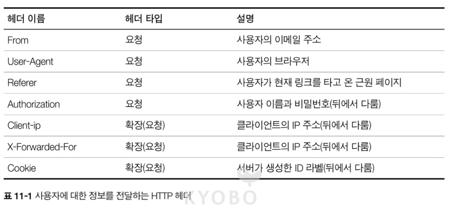

## 11.3 클라이언트 IP 주소

- 초기 웹은 사용자 식별에 클라이언트의 IP 주소를 사용하려 시도하였으나 다양한 약점을 보유
- IP 주소를 통한 사용자 식별 방식의 약점
  - IP 는 사용자가 아닌 컴퓨터를 가르키므로 명확한 사용자 식별이 불가능
  - 동적 IP 할당으로 인한 기술적인 한계
  - 방화벽에 의한 실제 IP 주소 추적의 어려움
  - 프락시 혹은 게이트웨이 사용 시, 서버는 프락시와 게이트웨이의 IP 주소를 알 수 밖에 없는 문제

## 11.4 사용자 로그인

- 사용자에게 로그인을 요구하여 사용자를 명시적으로 식별
- 다만 사용자에게 액션이 요구되는 만큼 로그인을 안한 사용자에 대한 식별이 불가능


## 11.5 뚱뚱한 URL

- 특정 웹사이트의 경우 사용자의 URL 마다 버전을 기술하여 사용자를 식별하고 추적
- 사용자가 웹 사이트에 처음 방문하면 사용자 식별을 위한 유일한 ID 가 생성되고, 해당 값을 서버가 URL 에 추가하여 클라이언트를 리다이랙트 시키는 방식으로 사용

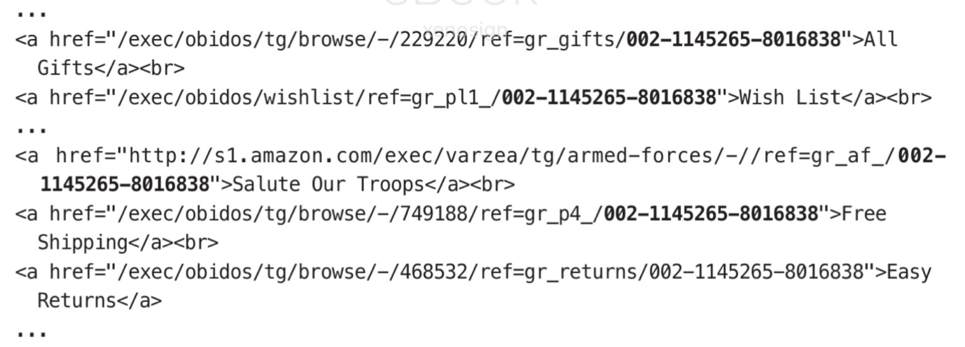

- 뚱뚱한 URL 의 문제점
  - 못생긴 URL : 사용자에게 혼란 제공
  - 공유하지 못하는 URL : URL 에 사용자 및 세션 상태 정보가 들어가므로 문제 발생
  - 캐시 사용 불가능 : 사용자 및 세션 상태에 따라 URL 이 달라지므로 캐시 사용이 불가능
  - 서버 부하 가중 : 사용자 별로 뚱뚱한 URL 이 포함된 페이지를 다시 그려야 하는 문제
  - 이탈 : 뚱뚱항ㄴ URL 에서 이탈하게 되면 이전의 추적 상태를 전부 잃게 되는 문제
  - 세션 간 지속성 부재 : 사용자가 URL 를 북마킹 하지 않고 로그아웃 하면 모든 정보를 읽게 됨

## 11.6 쿠키

- 쿠키는 사용자를 식별하고 세션을 유지하는 방식 중 가장 널리 사용되는 방식

### 11.6.1 쿠키의 타입

- 쿠키는 세션 쿠키(Session Cookie)와 지속 쿠키(Persistent Cookie) 두 가지로 나뉜다
- 세션 쿠키는 사용자가 사이트를 탐색할 때, 관련 설정과 선호 사항을 저장하는 임시 쿠키로 사용자가 브라우저를 닫으면 삭제
- 지속 쿠키는 사용자가 주기적으로 방문하는 사이트의 설정 정보 혹은 로그인 정보를 유지하려고 사용되며 브라우저를 닫아도 남아있음
- 두 쿠키의 차이는 파기되는 시점 뿐이며, 세션 쿠키는 유효 기간을 알려주는 Discard, Expires 혹은 Max-Age 파라미터가 없으면 세션 쿠키가 된다

### 11.6.2 쿠키는 어떻게 동작하는가

- 서버는 사용자를 식별하기 위해 유일한 값(Session ID)을 생성하여 쿠키에 담고, 해당 쿠키를 HTTP 응답 헤더에 Set-Cookie, Set-Cookie2 를 사용하여 전달
- 사용자가 해당 서버를 재방문하면 브라우저는 받았던 쿠키를 요층 헤더에 담아서 서버로 전달

### 11.6.3 쿠키 상장 : 클라이언트 측 상태

- 쿠키의 기본적인 발상은 브라우저가 서버 관련 정보를 저장하고, 사용자가 해당 서버에 접근할 때 마다 그 정보를 함께 전송게 하는 것
- 브라우저는 쿠키 정볼르 저장할 책임이 있는데, 이를 `클라이언트 측 상태` 라 하며, 공식 이름은 `HTTP 상태 관리 체계(HTTP State Management Mechanism)` 이다

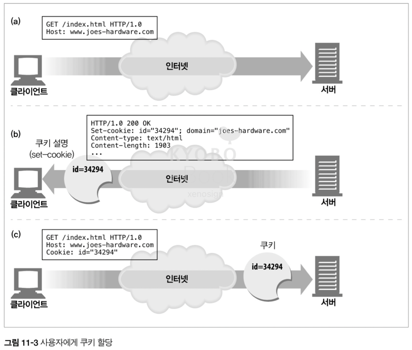

#### 구글 크롬 쿠키

- 브라우저는 각기 다른 방식으로 쿠키를 저장하며 크롬은 SQLite 를 사용하여 저장

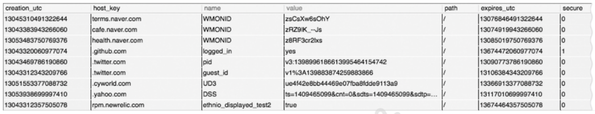

- 각 필드의 의미
  - creation_utc : 쿠키의 생성 시점이며 유닉스 시간 기준(1970년 1월 1일 0시를 기준으로 ms 단위로 누적한 시간, 에포크 시간)
  - host_key : 쿠키가 발행 된 서버의 도메인
  - name : 쿠키의 이름
  - value : 쿠키의 값
  - path : 쿠키와 관련 된 도메인에 있는 경로
  - expire_utc : 쿠키의 파기 시점, 동일하게 유닉스 시간 기준
  - secure : 해당 쿠키가 SSL 커넥션일 경우에만 보낼지 설정

#### 마이크로소프트 인터넷 익스플로러 쿠키

- 인터넷 익스플로러는 캐시 디렉터리에 개별 파일로 쿠키를 저장

### 11.6.4 사이트마다 각기 다른 쿠키들

- 브라우저는 수 많은 쿠키를 가지고 있지만, 성능 및 보안상의 이유로 아래의 내용에 부합하는 쿠키만을 사이트에 전송
- 도메인 일치(Domain)
  - 쿠키가 설정 된, 도메인 & 서브 도메인에 요청이 발생할 경우에만 전송
- 경로 일치(Path)
  - 쿠키가 설정 된 경로 및 하위 경로에 요청할 때만 전송
- 보안 프로토콜(Secure)
  - 해당 속성이 있을 경우 SSL 커넥션이 보장되는 HTTPS 일 때만 전송
- 사이트 동일성(SameSite)
  - 쿠키를 다른 외부 도메인으로 보내도 괜찮을지에 대한 설정 값으로, 교차 사이트 요청 위조(CSRF, Cross-Site Request Forgery)를 방어하기 위해 도입
  - Strict(엄격) : 현재 접속한 사이트와 완전히 동일한 도메인에만 쿠키를 전송
  - Lax(느슨, 최신 브라우저의 기본 값) : GET 요청은 허용되나, 서버에 문제를 일으킬 수 있는 비멱등 요청인 POST/PUT 혹은 iFrame 요청에는 전송 되지 않음
  - None : 교차 사이트 요청을 포함 모든 요청에 쿠키를 전송

> CSRF(CSRF, Cross-Site Request Forgery) 명확히 알기
>
> - 이전에 방문한 사이트에서 발급한 세션 쿠키를 바탕으로 악성 사이트의 동작을 통해 이전 사이트에게 악의적 요청을 보내는 방법
> - 서버 입장에서는 정당한 세션 쿠키가 전송 되므로 해당 요청을 수행 -> 문제 발생
> - 문제 해결책
>   - 서버에서 임의의 CSRF 토큰을 발생 -> 해당 토큰을 HTTP 헤더 혹은 hidden 필드에 담아서 전송 -> 공격자는 해당 값을 알 수 없으며, 서버에 동일한 세션 쿠키가 전달이 되어도 토큰 값이 오지 않기 때문에 처리를 거부(403 Forbidden)
>   - SameSite 옵션을 Lax 혹은 Strict 로 하면 타 도메인의 쿠키가 전송이 X -> 서버는 세션 쿠키를 받지 못함 -> 처리 거부

> iFrame 요청이 막히는 이유는 무엇일까요?
>
> - 악성 사이트에 iFrame 을 사용, 사용자가 이전에 접근 했었던 사이트를 투명하게 iFrame 으로 띄운 뒤 악성 사이트에의 동작이 이전 사이트에게 악의적 요청을 보내는 방법으로 CSRF 공격 가능

### 11.6.5 쿠키 구성 요소

- 과거 사용되는 쿠키는 Version 0 쿠키로 넷스케이프 쿠키로 불리운다
- Version 1 쿠키는 Version 0 의 확장으로 RFC 2965 에서 정의된 쿠키이나 널리 쓰이진 않으며 거의 폐기된 상태

### 11.6.6 Version 0 쿠키 (넷스케이프 쿠키)

- 최초에 넷스케이프가 정의한 쿠키
- 각각의 이름 = 값 으로 구선된 쿠키 옵션 속성들을 `;` 으로 이어서 기술

#### Version 0 의 Set-Cookie 헤더

- 이름 = 값 : (필수) 쿠키에 저장하고 싶은 속성과 해당 값을 지정
- Expires : (선택) 쿠키의 파기 일자를 지정
- Domain : (선택) 쿠키를 전달할 수 있는 도메인을 지정
- Path : (선택) Path 에 기술 된 경로에 맞는 경로에만 쿠키 전달
- Secure : (선택) HTTPS 에서만 전달 가능

`Set-Cookie: customer=lee; expires: Sunday, 14-December 10:00:00 GMT+9; domain="gg.com"; path=/orders; secure`

### 11.6.7 Version 1 (RFC 2965) 쿠키

- V0 에 비해 복잡하며 브라우저나 서버가 완전히 지원 X -> 결국 폐기
- V0 대비 변경 사항
  - 쿠키마다 목적을 설명하는 설명문 존재
  - 파기 주기와 상관 없이 브라우저가 종료되면 강제 삭제 가능
  - 절대 날짜 값을 사용하는 expires 가 아닌 생성 시점으로 부터의 초단위를 기록하는 Max-Age 설정 가능
  - 도메인, 경로 이외에도 포트 번호로도 쿠키 제어 가능
  - 사용자 이름과 추가적 키워드 구분을 위해 헤더에 $ 접두어 존재

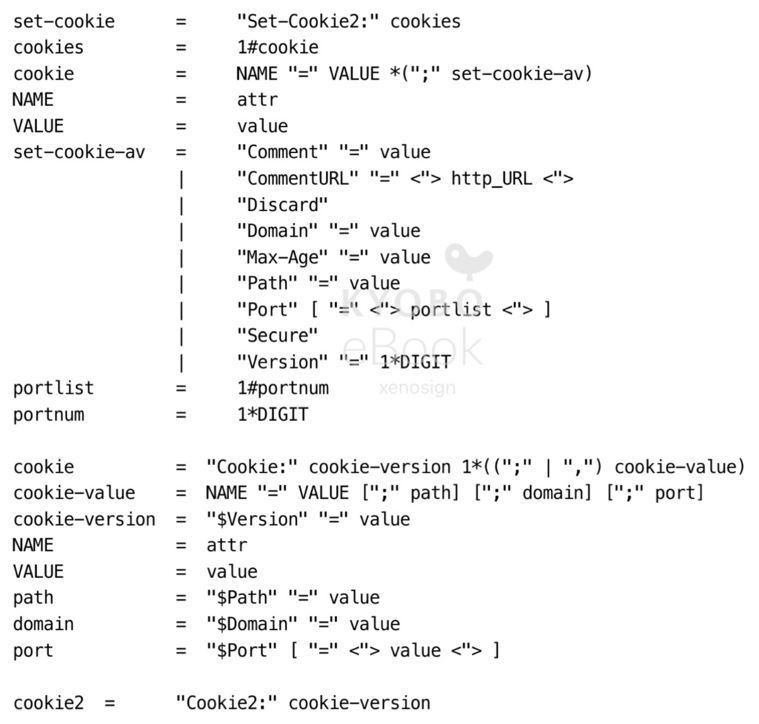

#### Version 1 Set-Cookie2 헤더

- V0 의 Set-Cookie 헤더와 구별되어 사용하며, 더 많은 속성과 기능을 지원

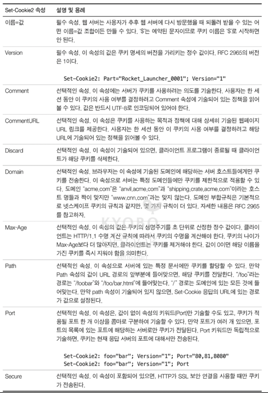

#### Version 1 Cookie 헤더

- 해당 쿠키가 가기조 있는 값들 중에서 현재 사이트에 맞는 값만을 조합 후, $ 를 붙여서 전송

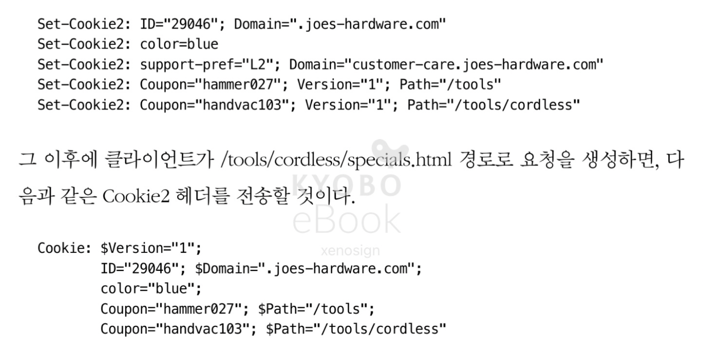

#### Version 1 Cookie2 헤더와 버전 협상

- Cookie2 요청 헤더는 각기 다른 쿠키 버전을 지원하는 클라이언트와 서버 간의 호환성을 협상하는 용도로 사용
- `Cookie2: $Version="1"` 을 서버에서 받으면 서버는 Set-Cookie 가 아닌 Set-Cookie2 헤더를 사용해서 쿠키를 전달
- 해당 내용이 없으면 V0 의 Set-Cookie 를 사용하면 된다. 즉, 업그레이드를 할 수 있다는 의미로 `Cookie2: $Version="1"` 를 사용

> 현재는 Version 2(RFC 6265) 버전을 사용
>
> - Version 1 쿠키는 복잡성으로 인해 폐기, V2 에서는 V0 과 같이 버전 표기 및 복잡한 속성을 제거하고 현대에 필요한 기능만 추가
> - 보안을 위한 HttpOnly, SameSite, Secure 속성과, 생성 시점 기반으로 수명 지정이 가능한 Max-Age 지원

### 11.6.8 쿠키와 세션 추적

- 서버가 쿠키 설정을 통해 식별 정보를 첨부하기 위한 `amazon.com` 의 트랜잭션 순서 (뚱뚱한 URL 사용의 케이스)
  - (a) 브라우저가 `amazon.com` 의 루트 페이지 요청
  - (b) 서버는 브라우저를 쿠키 설정 및 사용자 식별을 위한 URL 로 리다이렉트
  - (c) 브라우저는 받은 리다이렉트 URL 을 요청
  - (d) 서버는 응답에 서버에서 필요한 쿠키에 사용자 식별 정보를 담아서 응답
  - (e) 브라우저는 뚱뚱한 URL 을 사용하여 사용자 식별 정보를 담은 URL 에 받은 쿠키를 담아서 요청
  - (f) 서버는 식별 작업을 완료하고 사용자에게 home.html 에 접근이 가능한 URL 로 리다이렉트
  - (g) 클라이언트는 home.html 을 요청
  - (h) 서버에서 home.html 컨텐츠를 전달

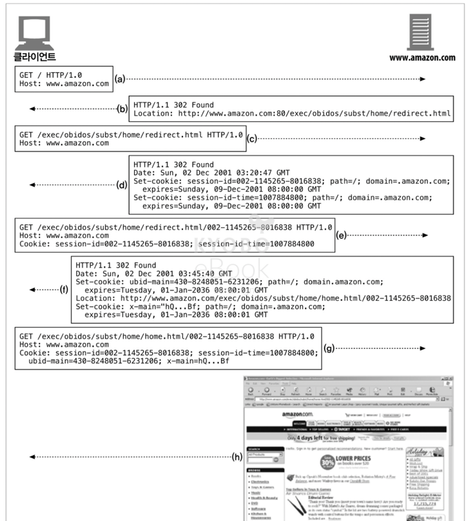

> 현대는 session-id 가 URL 에 노출되는 심각한 보안 위협으로 인해 뚱뚱한 URL 을 사용하지 않으며, 따라서 복잡한 리다이렉트 과정 없이 로그인과 JWT 를 쿠키에 담아 전달하는 방식으로 간단하게 수행

### 11.6.9 쿠키와 캐싱

- 쿠키를 캐싱하게 되면 이전 사용자의 쿠키가 다른 사용자에 할당되는 등의 문제 생기거나, 개인 정보가 유출되는 등의 문제가 발생하므로 주의가 필요

#### 캐시되지 말아야 할 문서가 있다면 표시하라

- 캐시를 하면 안되는 문서 + 쿠키의 경우 `Cache-Control: no-cache="Set-Cookie"` 로 명확하게 표시

#### Set-Cookie 헤더를 캐시하는 것에 유의하라

- 응답이 Set-Cookie 헤더를 가지는 경우 본문은 캐시할 수 있지만, 헤더를 캐시하는 것에는 주의가 필요
- `Cache-Control: must-revalidate, max-age=0` 같은 헤더를 추가하여 재검사를 강제하는 편이 좋다

#### Cookie 헤더를 가지고 있는 요청을 주의하라

- 요청이 Cookie 헤더랑 같이 오는 경우 Cookie 에 개인 정보가 담겨있을 수 있으므로, 캐시에 주의를 기울여야 한다
- 최고의 방법은 위와 같이 매번 재검사를 하도록 강제하는 편이 좋다

### 11.6.10 쿠키, 보안, 그리고 개인정보

- 중요한 정보는 서버와 연결된 원격 데이터베이스에 저장하고 쿠키에는 해당 DB 에 접근 가능한 키를 저장하는 방식을 표준으로 사용하면 쿠키에 예민한 데이터가 담기는 것을 줄일 수 있다
- 쿠키는 세션 조작 혹은 트랜잭션상에서의 편리함이 더 크지만, 개인정보를 다루거나 사용자를 추적하는 것은 언제든이 악용이 가능하므로 주의가 필요하다

> 현대에는 쿠키에 개인정보는 절대 담지 않으며, 중요 정보에 접근하기 위한 Key 역시도 JWT 로 암호화 하여 사용하는 것이 대세

---

# 12. 기본 인증

- 웹은 편리함을 제공하지만 특정 문서 혹은 데이터는 권한에 따라 접근이 달라져야 하므로, HTTP 는 자체적인 인증 관련 기능을 제공

## 12.1 인증

- 인증은 당신이 누구인지 증명하는 것
- 완벽한 인증이란 없으며, 비밀번호는 추측하거나 해킹이 가능하며 신분증은 위조되거나 도둑 맞을 수 있다

### 12.1.1 HTTP 의 인증 요구 / 응답 프레임워크

- HTTP 는 기본적으로 사용자 인증을 하는 데 자체 인증 요구 / 응답 프레임워크를 제공

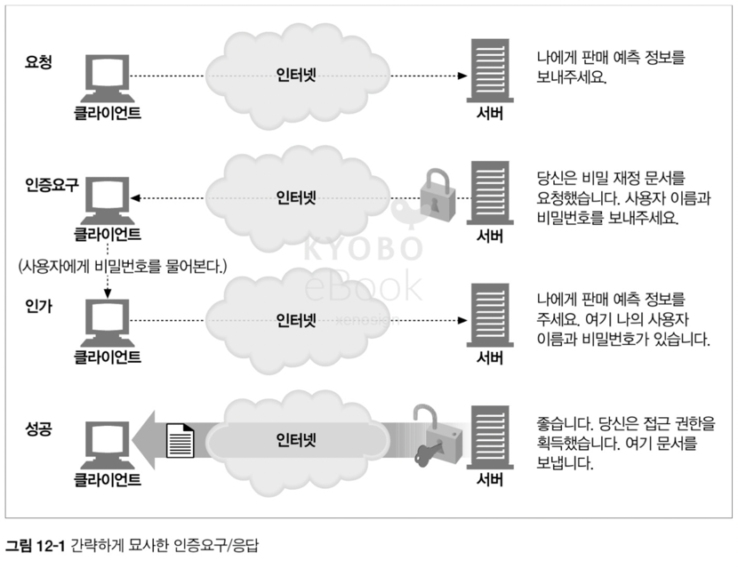

- 웹 서버가 HTTP 요청 메시지를 받으면 서버는 요청을 처리하는 대신 사용자가 누구인지 식별하기 위한 '인증 요구'로 응답할 수 있다
- 해당 '인증 요구' 에 적절한 인증 정보를 첨부하지 못할 경우 서버는 해당 응답을 거부

### 12.1.2 인증 프로토콜과 헤더

- HTTP 는 필요에 따라 고쳐 쓸 수 있는 제어 헤더를 통해, 각기 다른 인증 프로코톨에 맞추어 확장할 수 있는 프레임워크를 제공
- HTTP 는 기본 인증과 다이제스트 인증이라는 2 가지 공식 인증 프로토콜을 제공하며, 다이제스트 인증은 13장에서 다룬다

|   단계    |        헤더         | 설명                                                                                                                                  | 메서드/상태      |
| :-------: | :-----------------: | :------------------------------------------------------------------------------------------------------------------------------------ | :--------------- |
|   요청    |                     | 첫 번째 요청, 인증 정보 X                                                                                                             | GET              |
| 인증 요구 |  WWW-Authenticate   | 서버는 사용자 식별을 위해 적절한 인증을 요구하면서 401 상태 코드와 요청을 반려, 서버에서 요구하는 인증은 WWW-Authenticate 헤더에 기술 | 401 Unauthorized |
|   인증    |    Authorization    | 클라이언트는 서버의 인증 요구에 맞추어 Authorization 헤더를 작성하여 요청을 다시 보낸다                                               | GET              |
|   성공    | Authentication-info | 인증이 성공하면, 서버는 요청한 응답을 전송. 추가 적인 인증 세션 정보는 Authentication-info 에 담아서 전달                             | 200 OK           |

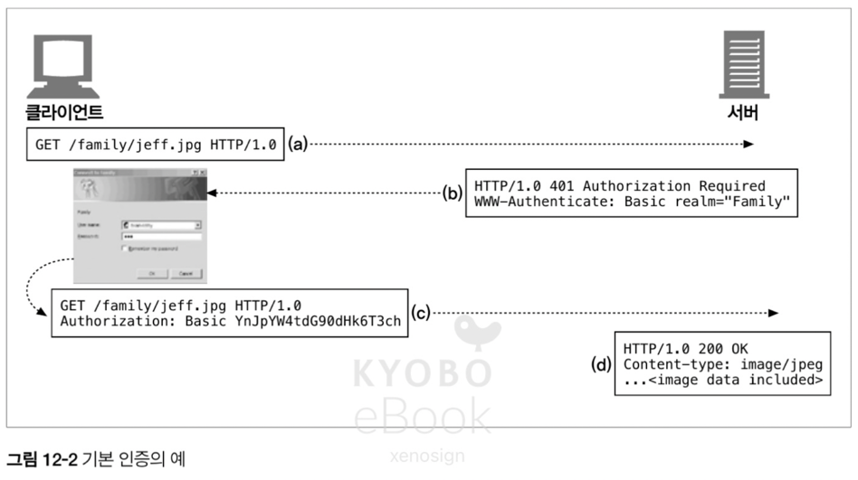

### 12.1.3 보안 영역

- 서버에 존재하는 리소스에 따라 상이한 접근 조건이 있는 경우에는 `보안 영역(realm)` 그룹으로 나누어 관리
- 아래는 재무 영역과 가족 영역으로 나뉜 realm 과 그에 따른 HTTP 응답 예시

```http
HTTP/1.0 401 Unauthorized
WWW-Authenticate: Basic realm="Corporate Financials"
```

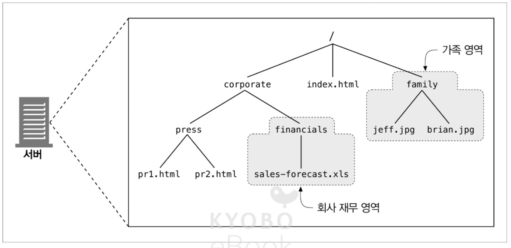

## 12.2 기본 인증

- 기본 인증에서 웹 서버는 클라이언트의 요청을 거부하고 유효한 사용자 이름과 비밀번호 요구 가능
- 서버는 WWW-Authenticate 헤더에 필요한 인증 정보를 요청하고, 클라이언트는 이에 맞는 인증 정보를 Authorization 헤더 안에 암호화 해서 서버로 보내는 방식

### 12.2.1 기본 인증의 예

- 서버의 인증 요구 응답

```http
HTTP/1.0 401 Unauthorized
WWW-Authenticate: Basic realm="보안 영역의 이름"
```

- 클라이언트의 인증 정보를 담은 요청

```http
GET /corporate/financials/sales-forecast.xls HTTP/1.0
Authorization: Basic base-62로 인코딩한 사용자 이름과 비밀번호
```

### 12.2.2 Base-64 사용자 이름 / 비밀번호 인코딩

- HTTP 기본 인증은 사용자 이름과 비밀번호를 `:` 으로 이어서 합치고 base-64 로 인코딩 하여 전달
- base-64 는 바이너리, 텍스트, 국제 문자 데이터 등 시스템에서 문제를 일으킬 수 있는 문자열을 알파벳으로 변환하기 위해 개발
- HTTP 기본 인증에서는 헤더에서 사용할 수 없는 문자(큰따옴표, 콜론, 캐리지 리턴 등)를 알파벳으로 변환하기 위해서, 그리고 비밀번호가 쉽게 노출 되는 문제를 예방하기 위해 사용

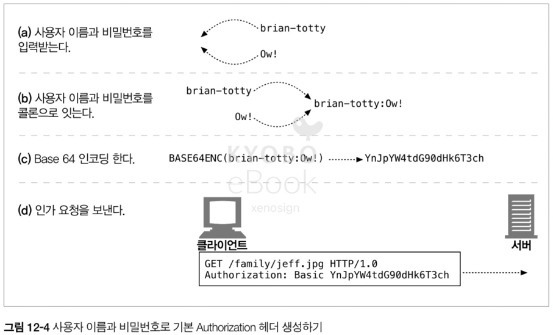

> Base64 작동 원리
>
> - 64개의 안전한 문자(a ~ Z, 0 ~ 9, +, /)와 길이를 채우기 위한 패딩 문자(=)로만 인코딩
> - 원본 데이터에 구조에 상관 없이 3byte(= 24bit) 단위로 데이터를 잘라서 가져온 뒤, 각각 6bit 씩 4개로 자름
> - 잘려진 4개의 6bit(= 최대 64의 값을 저장) 는 데이터의 값에 따라 Base64 에서 사용하는 64개의 문자 중 하나로 매핑되어 인코딩
> - 결과적으로 3byte 의 원본데이터가 4개의 문자로 인코딩 되므로 4개 x 1byte = 4byte 가 되어 33%의 용량이 증가
> - 원본의 마지막 데이터 길이가 3byte 의 배수가 아닌 경우 패딩 문자(=)를 사용하여 빈 공간을 채움
> - 암호화는 아니므로 누구나 디코딩이 가능, 목적에 맞게 사용이 필요

### 12.2.3 프락시 인증

- 특정 상황의 경우 서버에 접근하기 전, 중개 프락시 서버를 통해 인증을 처리
- 특정 서버 전체에 대한 접근 자체를 관리하는 경우에는 유용
- HTTP 헤더와 응답코드는 기본 인증과 동일

## 12.3 기본 인증의 보안 결함

- 기본 인증은 단순하고 편리하지만 보안적 결함이 있으므로, SSL 과 같은 암호 기술과 혼용
- 기본 인증의 보안적 결함
  - base-64 인코딩의 경우 누구나 디코딩을 할 수 있는 문제
  - 암호화 하여 정보를 전달하여도 제 3자가 해당 값을 볼 수 있으므로, 값을 탈취하여 악용 가능
  - 인증 헤더 이외에 부분을 수정하여 악의적 공격 가능
  - 악의적 가짜 서버의 위장에 취약
- 위오와 같은 문제를 해결하기 위해 HTTP 요청 자체를 암호화 해서 보내는 SSL 과 연계에서 사용하는 것이 보편 적

> 현대 웹에서의 보안 접근
>
> - 현대 욉은 '통신 채널'과 '인증 정보'를 둘 다 개선하여 보안을 처리
> - 통신 채널의 경우 HTTPS 를 사용하여 통신 자체를 암호화
> - 인증 정보의 경우 JWT 를 사용, 정보 자체를 암호화 하여 전달
> - 또한 해당 쿠키의 경우 HttpOnly, Secure 속성을 사용하여 통신 시에만 사용이 가능하며 JS 로 접근이 불가능 하도록 하여 XSS 공격 자체를 무효화
