# 18. 웹 호스팅

- 콘텐츠 리소스를 저장, 중개, 관리하는 일을 통틀어 웹 호스팅이고 한다
- 이 장에서 배울 내용
  - 여러 웹 사이트를 같은 서버에 "가상 호스팅" 하는 법, 그리고 그것이 HTTP 에 끼치는 영향
  - 트래픽이 많은 상황에서 안정적인 사이트를 구축하는 방법
  - 웹 사이트 로딩을 더 빠르게 하는 방법

## 18.1 호스팅 서비스

### 18.1.1 간단한 예 : 전용 호스팅

- 사람들은 직접 서버를 구매하고 유지보수하는 대신, ISP(Internet Service Provider)로 부터 전용 웹 서버를 임대해서 사용 가능

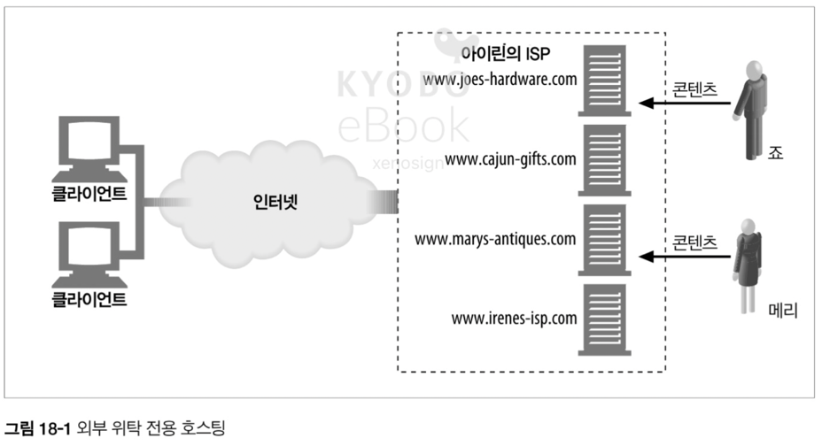

## 18.2 가상 호스팅

- 많은 웹 호스팅 업자는 서버 한 대를 여러 고객이 공유하게 해서 저렴한 웹 호스팅 서비스를 제공, 이를 가상 호스팅이라 한다
- 호스팅 업자는 복제 서버 더미(= 서버 팜)를 만들고, 서버 팜에 부하를 분산하는 방식을 사용

### 18.2.1 호스트 정보가 없는 가상 서버 요청

- HTTP/1.0 명세는 하나의 웹 서버가 한 웹 사이트만 호스팅 할 것이라 예측, 공용 웹 서버가 호스팅하고 있는 가상 웹 사이트에 누가 접근하고 있는지 식별하는 기능이 없어 가상 호스팅에 관한 설계 결함이 존재
- ex) `http//gg.com/index.html` 에 접근하려고 하면 `GET /index/html` 을 요청. 같은 서버에서 호스팅되는 `http//gl.com/index.html` 에 접근하려고 해도 `GET /index/html` 요청

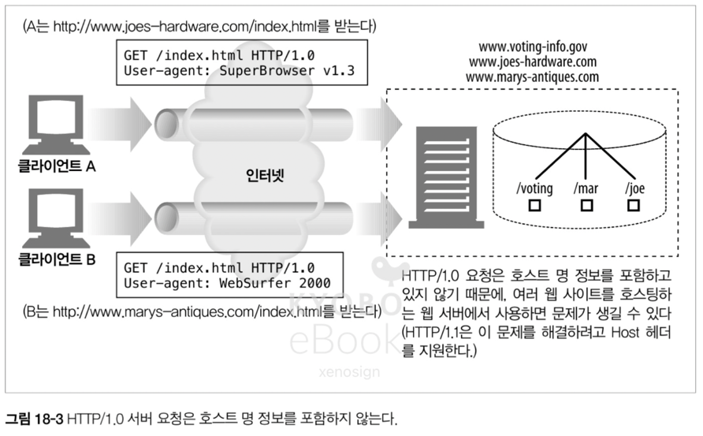

## 18.2.2 가상 호스팅 동작하게 하기

- HTTP/1.0 에서도 가상 호스팅을 사용하기 위해서 아래의 4 가지 방법이 탄생

#### URL 경로를 통한 가상 호스팅

- URL 에 특별한 경로 컴포넌트를 추가
- ex) `GET /joe/index.html` 과 `GET /mary/index.html` 과 같이 경로 컴포넌트를 추가

#### 포트 번호를 통한 가상 호스팅

- 각 사이트 별로 다른 포트 번호를 부여
- 단 80번이 아닌 비표준 포트를 사용자가 직접 입력해야 하는 불편함이 존재

#### IP 주소를 통한 가상 호스팅

- 각 사이트에 IP 주소를 할당하고 각각 도메인에 할당 된 IP 를 연결, 모든 IP 주소는 하나의 서버에서 처리
- 시스템이 처리할 수 있는 IP 개수의 제한으로 인해 한계가 발생

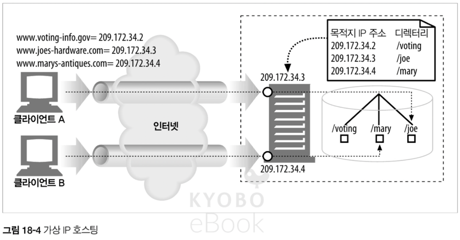

#### Host 헤더를 통한 가상 호스팅

- HTTP/1.1 에서는 모든 요청에 호스트명 과 포트를 전달하는 `Host 요청 헤더`를 정의하고, 이를 통해 해결

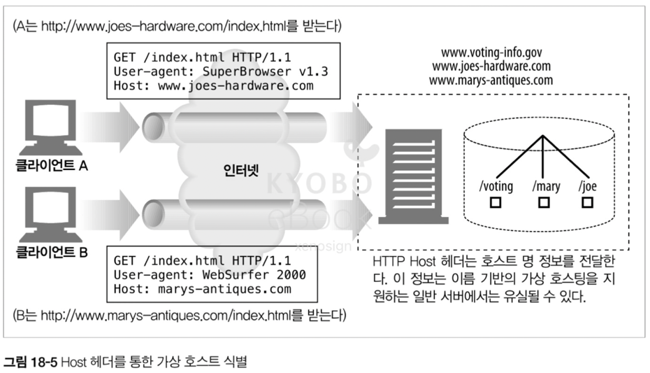

### 18.2.3 HTTP/1.1 Host 헤더

#### 문법과 사용 방법

- `Host = "Host" ":" 호스트[ ":"포트 ]`
  - ex) Host: www.gg.com
- Host 헤더의 규칙
  - 포트가 기술되어 있지 않으면, 기본 포트(80) 사용
  - URL 에 IP 주소가 있으면, Host 헤더는 같은 주소를 포함
  - URL 에 호스트 명이 기술되어 있으면, Host 헤더는 같은 호스트 명을 포함
  - URL 에 호스트 명이 기술되어 있으면, Host 헤더에는 IP 주소가 포함되서는 안된다 (하나의 IP 에서 여러 도메인을 호스팅 하는 경우에 대비)
  - 프락시 사용시 Host 헤더에는 프락시가 아닌 원 서버의 호스트 명과 포트를 기술
  - 모든 요청 메시지에는 Host 헤더가 필수
  - HTTP/1.1 서버는 Host 헤더가 없는 경우 400 에러를 반환

#### Host 헤더의 누락

- 낡은 클라이언트에서 Host 헤더를 누락해서 보내는 경우, 서버는 사용자를 기본 웹페이지로 보내거나 브라우저 업그레이드를 제안 가능

#### Host 헤더 해석하기

1. HTTP 요청 메시지에 전체 URL 이 있으면 Host 헤더 값 보다는 URL 을 사용
2. 요청 메시지의 URL 에 호스트 명이 없다면 Host 헤더 값에서 호스트 명과 포트를 가져온다
3. 1, 2 를 만족하지 못하면 400 Bad Request 반환

#### Host 헤더와 프락시

- 몇몇 낡은 브라우저의 경우 원서버가 아닌 프락시의 이름을 Host 헤더에 담아 전송하는 문제가 있었음

## 18.3 안정적인 웹 사이트 만들기

- 웹 사이트의 대표적 장애 서버 다운 / 트래픽 폭증 / 네으워크 장애나 손실에 대처하는 방법을 알아보자

### 18.3.1 미러링 된 서버 팜

- 서버 팜에서 한 서버에 문제가 생기면 다른 곳에서 처리할 수 있도록 미러링이 가능
- 네트워크 스위치 등을 사용해서 서버 팜에서 각각 서버에 분산 요청을 보내는 방식을 사용

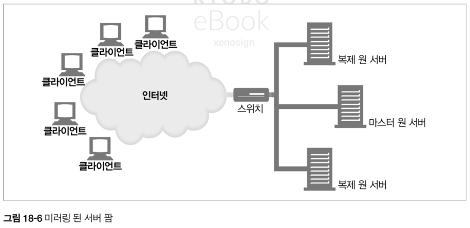

> 현대적인 방법은 무엇을 사용할까?
>
> - 물리적 처리(네트워크 스위치)는 가장 하위 레이어에서 사용하고 있으며, 대규모 데이터 센터나 초고속 트래픽 처리가 필요한 경우에 사용.
>   - 전용칩 사용으로 SW 에 의한 처리보다 훨 빠름. 하지만, 클라우드 시스템이 표준화 되어 해당 부분은 클라우드 제공 업체에 맡기는 편
> - 실질적으로는 물리적 처리 + SW 처리가 혼용된 AWS 의 로드 밸런싱 서비스를 사용
>   - GLB(Gateway Load Balancer) : 3계층(IP) 레벨에서 보안 검사 및 방화벽 처리
>   - NLB(Network Load Balancer) : 4계층(TCP/UDP) 레벨에서 IP 기반 라우팅
>   - ALB(Application Load Balancer) : HTTP 요청을 보고 경로/헤더/쿠키 기반의 SW 라우팅

### 18.3.2 콘텐츠 분산 네트워크

- CDN(Content Delivery Network) 는 특정 콘텐츠의 분산을 목적으로 하는 네트워크

### 18.3.3 CDN 의 대리 캐시

- 대시 서버는 미러링 된 웹 서버처럼 콘텐츠에 대한 요청을 받지만, 원 서버의 전체 콘텐츠를 복제하는 것이 아니라 클라이언트가 요청하는 콘텐츠만 저장한다

### 18.3.4 CDN 의 프락시 캐시

- 프락시 캐시는 콘텐츠 요청이 있을 때만 저장이 되므로 미러링 서버와 다른 방식으로 동작하며, 스위치 또는 라우터가 중간에서 웹 트래픽을 가로채서 처리하기도 한다

## 18.4 웹 사이트 빠르게 만들기

- 서버 팜, 분산 프락시 캐시 등은 콘텐츠를 더 가깝게 만들어 주므로 더 빠른 웹 사이트 구축에 도움이 된다
- 또한 콘텐츠 인코딩을 통해서도 웹 사이트 속도를 높일 수 있다

# 19. 배포 시스템

## 19.1 배포 지원을 위한 FrontPage 서버 확장

- FrontPage(FP) 는 다양한 기능을 제공하는 MS 의 웹 개발 및 배포 도구 집합

### 19.1.1 FrontPage 서버 확장

- "어디서든 배포한다" 라는 전략으로 FrontPage Server Extensions(FPSE) 서버측 SW 출시
- FPSE 는 웹 서버와 통합되어 FrontPage 로 작성 된 클라이언트와 서버 사이에 필요한 변환 작업을 수행
- HTTP POST 요청을 기반으로 RPC(Remote Procedure Call) 계층을 구현하여, FP 가 FPSE 를 이용 서버에 명령을 보낼 수 있도록 설계
- MS 의 IIS(Internet Information Services) 서버가 아니면 CGI 구성이 된 서버에서 적용이 가능

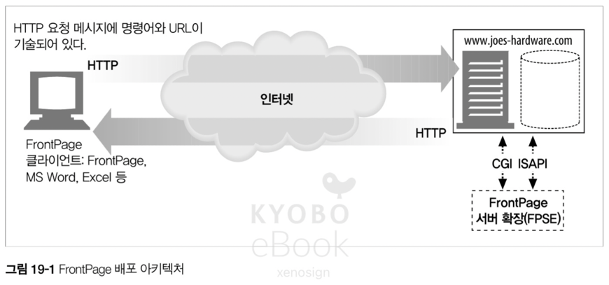

> IIS(Internet Information Services) 서버
>
> - MS 에서 개발한 Windows Server 와 긴밀 하게 통합
> - ASP.NET, PHP, Node.js 등 언어 지원
> - HTTP, HTTPS, FTP, SMTP 등 프로토콜 지원
> - 장점 : Windows 환경에 최적화, GUI 관리, .NET 완벽 지원
> - 단점 : Windows 서버 라이선스 필요, 리눅스 미지원

### 19.1.2 FrontPage 용어

#### 가상 서버

- 물리 서버에 올라간 가상 서버로, 가상 서버 하나당 웹 사이트를 호스팅

#### 루트 웹

- 웹 서버의 최상위 디렉토리

#### 서브 웹

- 루트 웹의 하위 디렉토리 또는 서브 웹의 하위 디렉토리

### 19.1.3 FrontPage RPC 프로토콜

- FP 의 PRC 프로토콜은 POST 요청으로 서버에 있는 대상 프로그램의 이름과 위치를 결정하는 방식으로 동작
- 위치에 있는 파일이 반환 되면 FP 클라이언트는 응답을 읽고 FPShtmlScriptUrl, FPSAuthorScriptUrl, FPSAdminScriptUrl 과 관련된 값을 읽고 처리

```
FPShtmlScriptUrl="_vti_bin/_vti_rpc/shtml.dll" (일반 사용자의 브라우징 명령에 대한 요청을 처리하는 파일)
FPSAuthorScriptUrl="_vti_bin/_vti_rpc/author.dll" (저작 사용자의 명령에 대한 요청을 처리하는 파일)
FPSAdminScriptUrl="_vti_bin/_vti_rpc/admin.dll" (관리 사용자의 명령에 대한 요청을 처리하는 파일)
```

#### 요청

- POST 요청의 본문에는 "method=<command>" 형식의 RPC 명령과 함께 필요한 모든 매개 변수가 띄어쓰기는 + 로 나머지는 아스키 펴현으로 인코딩 되어 기술

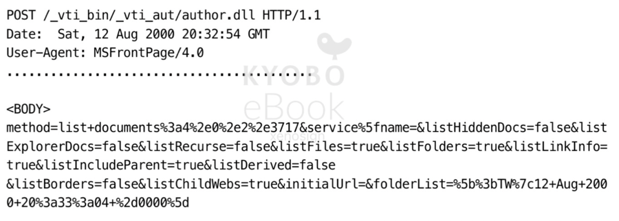

- 위 이미지의 실제 명령

```
method=list+document:4.0.1.3717
&service_name=
&listHiddenDocs=false
&listExploreDocs=false
```

- service_name : 메서드가 수행되어야 하는 웹 사이트의 URL
- listHiddenDocs : 웹의 숨겨진 문서를 보여주는 옵션
- listExploreDocs : "true" 일 경우 태스크 리스트를 나열

#### 응답

- FPSE 가 요청을 처리하고 FP 클라이언트에 반환하는 응답. 일반적으로 성공과 에러가 존재

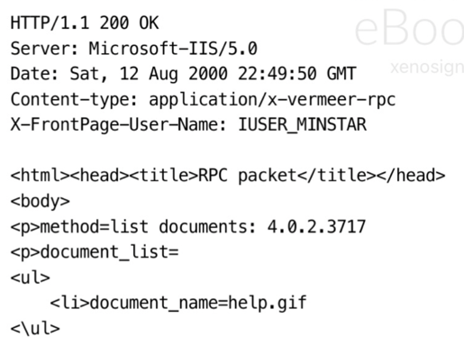

### 19.1.4 FrontPage 보안 모델

- FPSE 의 보안 모델은 사용자를 관리자 / 저작자 / 일반 사용자로 구분하여 처리
- IIS 서버에서 권한 여부는 주어진 명령의 루트에 대한 ACL 을 보고 검사
- 명령어에 기술 된 동적 링크 라이브러리(Dynamic Link Libraries, DLL) 를 기반으로 권한 검증을 수행
- FPSE 의 경우 관리자가 엉성하게 관리하는 경우 보안에 큰 취약점이 발생

## 19.2 WebDAV(Web Distributed Authoring and Versioning) 와 공동 저작

### 19.2.1 WebDAV 메서드

- WebDAV 는 새로운 HTTP 메서드 집합을 정의하고 HTTP 메서드의 동작 범위를 수정
- PROPFIND(Property Find) : 리소스의 속성을 읽는다
- PROPPATCH(Property Patch) : 리소스에 대해 속성을 설정
- MKCOL : 콜렉션을 생성
- COPY : 원본지에서 목적지로 리소르를 복사
- MOVE : 특정 소소를 목적지에 이동
- LOCK : 리소스를 잠근다
- UNLOCK : 리소스 잠금을 해제

### 19.2.2 WebDAV 와 XML

- HTTP 헤더 만으로는 여러 리소스와 계층을 표현하기 어려워 WebDAV 는 XML(Extensible Markup Language) 를 아래의 용도로 지원
  - 데이터를 어떻게 처리할 것인지 설명
  - 서버의 복잡한 응답을 표현
  - 콜렉션과 리소스를 처리하는 데 사용하는 커스텀 정보의 포맷
  - 데이터 자체를 표현할 수 있는 유연한 포맷
  - 국제화 관련 문제를 해결하기 위한 방안
- WebDAV 는 "DAV:" 라는 XML 전용 Namespace 를 정의

### 19.2.3 WebDAV 헤더

- WebDAV 는 기능을 넓히기 우해 HTTP 헤더를 도입

#### DAV

- WebDAV 를 제공하는 서버와 통신할 때 사용되며, OPTIONS 요청 대한 헤더에 이를 포함해야 함

#### Depth

- 여러 수준의 계층 구조로 분리된 리소스에 WebDAV 를 사용하기 위한 요소

#### Destination

- COPY 나 MOVE 의 목적지 URI 식별용

#### If

- 헤더의 조건 집합을 기술하기 위해 사용되며, 해당 조건이 맞지 않으면 요청이 실패

#### Lock-Token

- LOCK 을 제거하기 위해 UNLOCK 메서드에 사용

#### Overwrite

- 대상을 덮어쓸지 말지를 정하며, COPY 나 MOVE 에 사용

#### Timeout

- 클라이언트가 핑요한 잠금 타임아웃 값을 기술

### 19.2.4 WebDAV 잠금과 덮어쓰기 방지

- WebDAV 는 공동 작업 시, 특정 사용자의 작업이 덮어씌워지는 것을 막기 위해 LOCK 개념을 지원

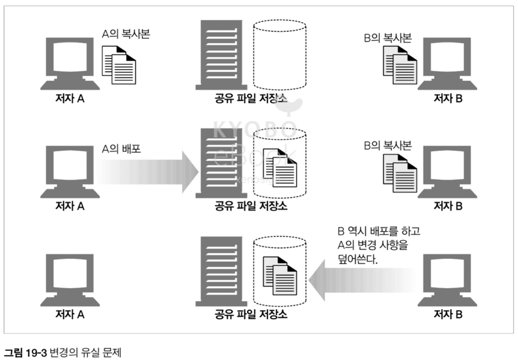

- 해당 잠금은 리소스나 콜렉션에 대한 배타적 쓰기 잠금 / 공유된 쓰기 잠금, 2가지 버전을 제공
- 배타적 쓰기 잠금은 잠금 소유자만 쓸 수 있게 보장
- 공유된 쓰기 잠금은 여러 사람으로 이루어져 있는 그룹이 하나의 문서에서 작업이 가능하게 가능. 단, git 같은 개념이 아니라서 주의가 필요

### 19.2.5 LOCK 메서드

- WebDAV 에서는 한 개의 LOCK 요청으로 여러 개의 리소스 잠금이 가능

```
LOCK /ch-publish.fm HTTP/1.1
Host: minstar
Content-Type: text/xml
User-Agent: Mozilla/4.0 (compatible; MSIE 5.0; Windows NT)
Content-Length: 201

<?xml version="1.0"?>
<a:lockinfo xmlns:a="DAV:">
    <a:lockscope><a:exlusive /></a:lockscope>
    <a:locktype><a:write/></a:locktype>
    <a:owner><a:href>Author</a:href></a:owner>
</a:lockinfo>
```

- `<locktype>` : 잠금 형식
- `<lockscope>` : 배타적 잠금 / 공유된 잠금 표시
- `<owner>` : 잠금의 소유자 표시

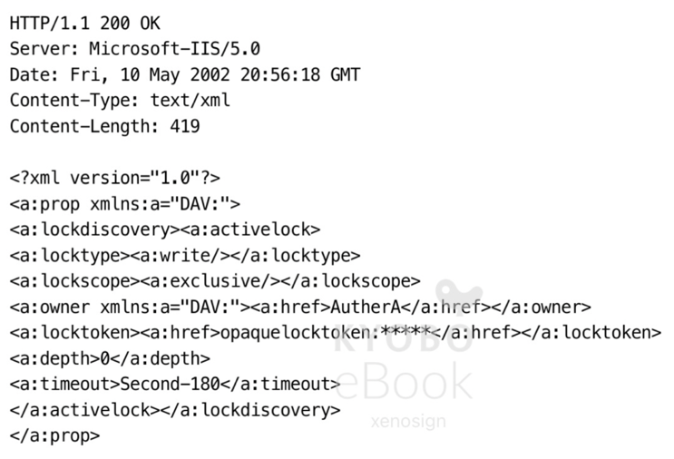
<br />_잠금 요청에 성공한 경우의 응답_

- `<locktoken>` : opaquelocktoken 토큰으로 잠금을 식별하는데 사용
- `<depth>` : Depth 헤더와 같은 값
- `<timeout>` : 잠금에 대한 타임 아웃

#### opaquelocktoken 스킴

- 언제든 모든 리소스에 유일한 토큰을 제공하기 위해 UUID(Universal Unique Identifier)를 사용하여 설계

#### lockdiscovery 요소

- 활성화 되어있는 잠금을 찾는 메커니즘을 제공

#### 잠금 갱신과 Timeout 헤더

- 잠금 갱신을 위해 클라이어트는 if 헤더에 잠금 토큰과 잠금 요청을 보내고, 반환 된 값을 받는데 이때 timeout 값은 이전의 timeout 값과 다르다
- 따라서 클라이언트는 LOCK 요청 안에 필요한 timeout 값을 기술해

### 19.2.6 UNLOCK 메서드

- UNLOCK 메서드는 다이제스트 인증을 성공하고 Lock-Token 헤더에 있는 잠금 토큰이 맞는지 검사하여 잠금을 제거

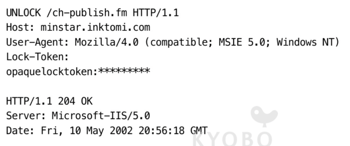
<br />_LOCK 요청_

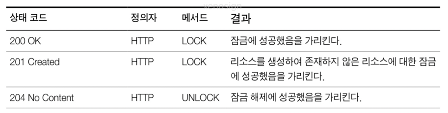
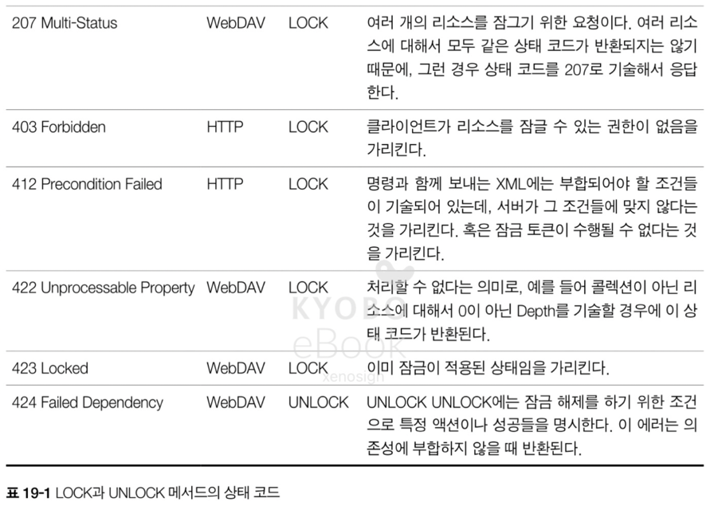
<br />_LOCK, UNLOCK 요청에 사용 가능한 상태 코드_

### 19.2.7 속성과 META 데이터

- META 태그에는 리소스의 정보을 담은 속성 값(저작자 이름, 수정 날짜, 내용 등급 등)을 기술
- WebDAV 와 같은 분산 협업 시스템은 META 태그에 더 복잡한 속성을 가진다
  - 저작자와 순간에 따라 달라지는 속성은 'live' 속성으로 부르며, 변하지 않는 Content-Type 같은 속성은 'dead' 속성으로 부른다
- WebDAV 는 속성의 바라견과 수정을 지원하기 위해 PROPFIND, PROPPATCH 라는 메서드를 확장 지원

### 19.2.8 PROPFIND 메서드

- 주어진 파일이나 파일 그룹의 속성을 읽는데 사용하는 메서드

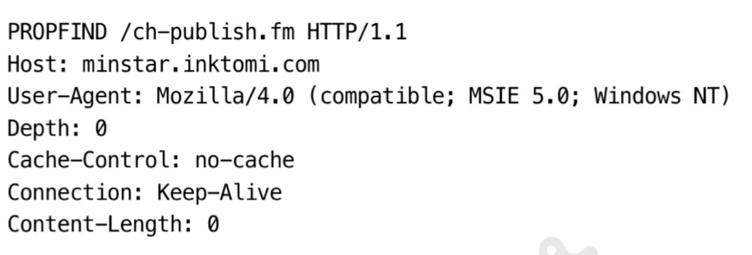

- `<allprop>` : 반환될 모든 속성의 이름과 값을 기술
- `<propname>` : 반환되 속성 이름의 집합을 기술
- `<prop>` : `<propfind>` 요소의 하위 요소, 반환될 값의 속성을 기술. `<a:prop> <a:owner /> </a:prop>` 과 같이 기술

_PROPFIND 요청에 대한 응답_

```
HTTP/1.1 207 Multi-Status
Server: Microsoft-IIS/5.0
..........

<?xml version="1.0"?>
<a:multistatus xmlns:b="urn:uuid:********/" xmlns:c="xml:" xmlns:a="DAV:">
  <a:response>
    <a:href>http://minstar/ch-publish.fm </a:href>
    <a:propstat>
      <a:status>HTTP/1.1 200 OK</a:status>
      <a:prop>
        <a:getcontentlength b:dt="int">1155</a:getcontentlength>
        ...........................
        ...........................
        <a:ishidden b:dt="boolean">0</a:ishidden>
        <a:iscollection b:dt="boolean">0</a:iscollection>
      </a:prop>
    </a:propstat>
  </a:response>
</a:multistatus>
```

- `<multistatus>` : 여러 응답을 담는 컨테이너
- `<href>` : 리소스의 uri
- `<status>` : 특정 요청에 대한 HTTP 상태 코드 기술
- `<propstat>` : status 와 prop 요소 한 개로 이루어진 집합

### 19.2.9 PROPPATCH 메서드

- 리소스의 여러 속성을 설정하거나 제거하는 원자적 메커니즘 제공
- `<set>` : 설정할 속성을 기술
- `<remove>` : 제거할 속성 기술

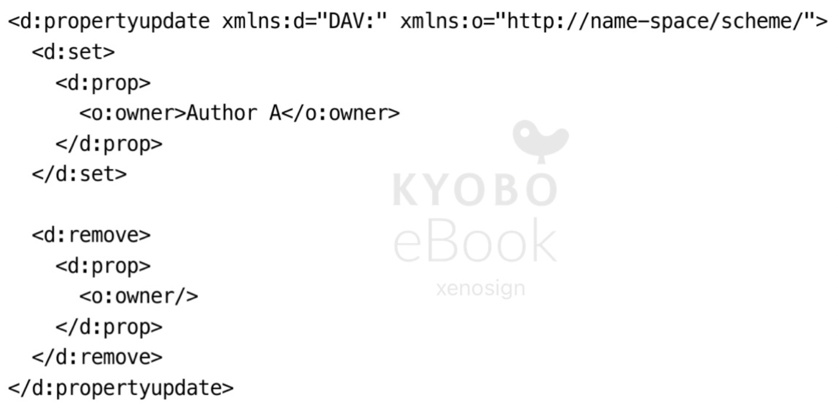

- 응답은 PROPFIND 와 비슷한 응답을 사용

### 19.2.10 콜렉션과 이름공간 관리

- 콜렉션은 사전에 정의한 계층에 있는 리소스들의 논리적 or 물리적 그룹으로 리소스들의 컨테이너
  - 파일 시스템의 디렉터리 처럼 관리되며, 콜렉션은 다른 콜렉션을 포함
- WebDAV 는 XML 이름공간 메커니즘을 사용하며, DELETE / MKCOL / COPY / PROPFIND 메서드를 제공

### 19.2.11 MKCOL

- MKCOL 메서드는 지정된 URL 에 해당하는 콜렉션을 서버에 생성
- POST 나 PUT 으로도 동일한 작업이 가능하지만, MKCOL 과 같은 중요 작업과 다른 메서드가 겹치는 이슈 및 해당 작업 시 프로토콜을 재정의 하는 문제등으로 인하여 MKCOL 을 사용
- 생성된 콜렉션은 DELETE 로 삭제 가능

### 19.2.12 DELETE 메서드

- DELETE 메서드는 HTTP 와 마찬가지로 지우는 작업을 수행, WebDAV 의 경우 Depth 정보를 바탕으로 지우는 범위 설정이 가능

### 19.2.3 COPY 와 MOVE 메서드

- COPY, MOVE 메서드 역시 GET 으로 리소스 다운 후 PUT 으로 다시 올리는 방식으로 대체가 가능하지만 COPY, MOVE 와 같은 특정적 작업 수행을 대체하기에는 무리가 있었음
- 역시 Depth 에 의해 범위의 영향을 받는다

#### Overwrite 헤더의 영향

- T/F 의 값을 통해 덮어쓰기 여부 결정이 가능

#### COPY/MOVE 의 속성

- 콜렉션이나 요소를 복사하면 기본적으로 그것들의 모든 속성이 복사, 단 몇몇 예외가 존재

#### 잠긴 리소스와 COPY/MOVE

- 잠긴 리소스의 경우 당연하게 COPY/MOVE 가 불가능
- 해당 요청에 대한 응답 표

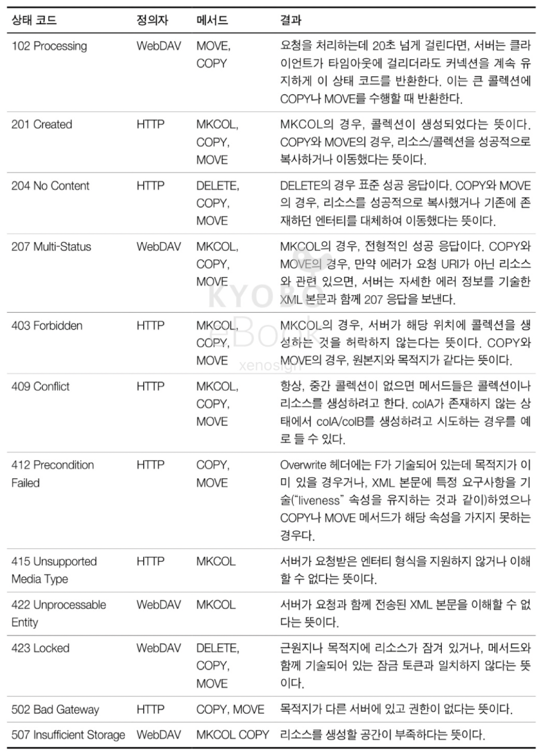

### 19.2.14 향상된 HTTP/1.1 메서드

#### PUT 메서드

- WebDAV 는 PUT 메서드에 잠금을 제공하기 위해 if 헤더를 추가

#### OPTIONS 메서드

- OPTIONS 메서드를 통해 WebDAV 서버가 제공하는 것들 확인이 가능

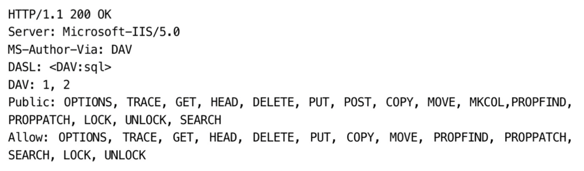

### 19.2.15 WebDAV 의 버전 관리

- DAV 중, V(Versioning) 은 나중에 추가 되었으며 수정의 유실을 막기 위해서는 잠근과 버저닝이 필수

### 19.2.16 WebDAV 의 미래
