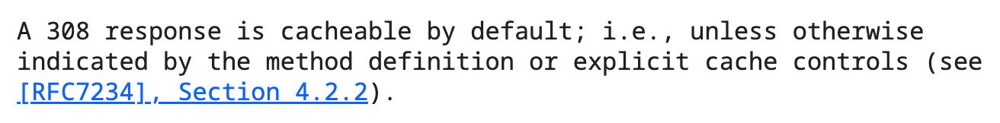

## 이야기거리

### Next에서 307과 308을 사용하는 이유

- next.config.js에서 redirects를 설정할 수 있음

> Next.js는 왜 307과 308을 사용할까요? 전통적으로 302는 임시 리디렉션에, 301은 영구 리디렉션에 사용되었지만, 많은 브라우저가 원래 메서드와 관계없이 리디렉션의 요청 메서드를 GET으로 변경했습니다. 예를 들어, 브라우저가 POST /v1/users로 요청을 보내고 location /v2/users와 함께 상태 코드 302를 반환받은 경우, 후속 요청은 예상했던 POST /v2/users 대신 GET /v2/users가 될 수 있습니다. Next.js는 307 임시 리디렉션과 308 영구 리디렉션 상태 코드를 사용하여 사용된 요청 메서드를 명시적으로 보존합니다.

- [공식문서](https://nextjs.org/docs/app/api-reference/config/next-config-js/redirects) 내용의 결론: 메서드를 보존하기 위해서

### 307 vs 308 사용과 관련

- 어떤 상태코드를 쓰는게 맞을까

> 한 쇼핑몰 웹사이트에서 상품 URL 구조를 변경하여 /products/item123을 /shop/items/item123으로 완전히 이전했습니다. 검색 엔진이 새로운 URL을 인덱싱하도록 하고, 사용자들이 북마크한 기존 URL도 영구적으로 새 URL로 안내하려고 합니다.
> 이 경우 서버에서 반환해야 할 가장 적절한 HTTP 상태 코드는 무엇입니까?

- 기획이 변경되어 원래 path로 가야하는데 브라우저가 캐싱으로 가지고 있던 상황
- 308은 조심히 써야겠다는 생각
- 308의 캐시 관련 [RFC 문서](https://datatracker.ietf.org/doc/html/rfc7538)
  
- 결국 사용자들의 캐시를 모두 삭제할 수 없으니 다른 경로를 썼던 기억

### 408과 504

- 둘 다 결국 서버가 클라이언트의 요청을 완수하기에 시간이 너무 많이 걸리는 경우인데 왜 하나는 400번대고 하나는 500번대 일까요
- 데이먼스 이어 노래 중에 504 GATEWAY TIMEOUT.. 아시나요
