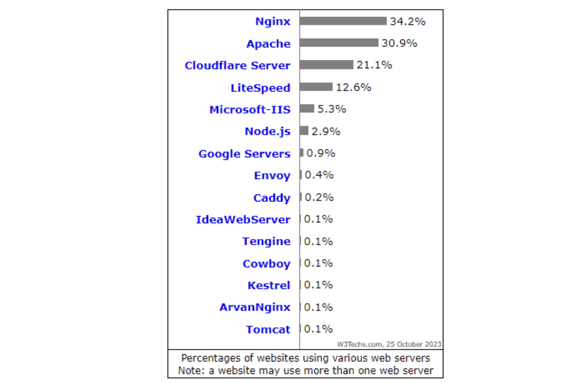
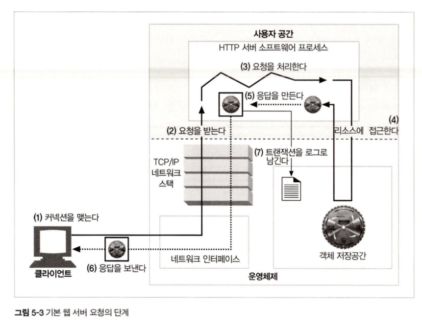

## 5장. 웹 서버

### 5-1 다채로운 웹 서버

웹 서버는 HTTP 및 그와 관련된 TCP 처리를 구현한 것

- HTTP 프로토콜을 구현
- 웹 리소스 관리
- 웹 서버 관리 기능

형태는 크게 두가지가 있다

- 흔히 서비스를 운영하거나할 때 사용되는 **다목적 소프트웨어 웹 서버**
- 소형 기기 인터페이스 형태로 제공되는 **임베디드 웹 서버**

2023년 기준 웹 서버 점유율은 다음과 같다.



### 5-2 간단한 펄 웹 서버

### 5-3 진짜 웹 서버가 하는 일



1. 커넥션을 맺는다
2. 요청을 받는다
3. 요청을 처리한다
4. 리소스에 접근한다
5. 응답을 만든다
6. 응답을 보낸다
7. 트랜잭션을 로그로 남긴다

### 5-4 클라이언트 커넥션 수락

- 클라이언트가 이미 서버에 대해 열려있는 지속적 커넥션을 갖고 있다면, 클라이언트는 요청을 보내기 위해 그 커넥션을 사용할 수 있고 그게 아니라면 서버에 대한 새 커넥션을 열어야한다.

**5.4.2 클라이언트 호스트 명 식별**

대부분의 웹 서버는 역방향 DNS(reverse DNS) 를 사용해 클라이언트 IP 주소를 호스트 명으로 변환하도록 설정되어 있다.

웹 서버는 이 호스트 명을 접근 제어와 로그 기록에 활용할 수 있다.

**5.4.3 ident를 통해 클라이언트 사용자 알아내기**

일부 웹 서버는 IETF ident 프로토콜을 지원한다. 이는 어떤 사용자가 HTTP 커넥션을 시작했는지 서버가 확인할 수 있게 해주어 웹 서버 로깅에 유용하다.

- 클라이언트가 ident를 지원한다면, 클라이언트는 TCP 113번 포트에서 ident 요청을 대기(listen)한다.

- 서버는 클라이언트와 맺어진 TCP 커넥션(클라이언트/서버 포트 번호 기반)에 대해, 해당 연결을 만든 사용자 이름을 묻는 요청을 보낸다.

현재는 거의 사용되지 않음: 보안 문제(사용자 정보 노출), 방화벽 차단, 신뢰성 부족 등의 이유로 실무에서는 사실상 사라진 기술이다.

### 5-5 요청 메시지 수신

커넥션에 데이터가 도착하면, 웹 서버는 네트워크 커넥션에서 그 데이터를 읽어 들이고 파싱하여 요청 메시지를 구성한다.

몇몇 웹 서버는 요청 메시지를 쉽고 신속하게 다룰 수 있도록 내부의 자료 구조에 저장한다.
ex) 헤더는 룩업 테이블에 저장되어 각 필드에 신속하게 접근 가능하다

**커넥션 입력 출력 처리 아키텍처**

웹 서버들은 항상 새 요청을 주시하고 있고 이를 처리하는 다양한 유형이 있다.

**단일 스레드 웹 서버**

- 한번에 하나씩 요청을 처리
- 처리 도중 다른 커넥션은 무시

**멀티 프로세스, 멀티스레드 웹 서버**

- 여러 요청을 동시에 처리하기 위해 여러개의 프로세스 또는 스레드에 각 커넥션을 할당한다
- 하지만 그로인해 만들어진 수많은 프로세스나 스레드는 너무 많은 메모리나 시스템 리소스를 소비하여 최대 개수에 제한을 둔다.

**다중 IO 서버**
다중 I/O 서버는 여러 클라이언트 연결을 동시에 처리하기 위해 설계된 서버 방식이다.

- 하나의 프로세스(또는 스레드)가 여러 네트워크 소켓을 비동기적으로 감시하며 필요한 시점에만 읽기/쓰기 작업을 수행한다.
- 소수의 스레드로도 수백~수천 개의 연결을 처리할 수 있다.

**다중, 멀티스레드 I/O 서버**

- 여러 프로세스 또는 스레드가 여러 커넥션을 비동기적으로 감시하며 필요한 시점에만 읽기/쓰기 작업을 수행한다

### 5-6: 요청 처리

- 웹 서버가 요청을 받으면, 서버는 요청으로부터 메서드, 리소스, 헤더, 본문을 얻어내어 처리한다.

### 5-7 리소스의 매핑과 접근

웹 서버는 들어온 URL을 실제 파일 시스템 경로로 변환하여 클라이언트가 요청한 리소스를 찾는다.

이를 리소스 매핑이라고 하며, 이 과정에서 가장 핵심이 되는 개념이 DocRoot와 가상 호스팅 DocRoot이다.

**DocRoot(Document Root)**

DocRoot는 웹 사이트의 최상위 디렉터리로,
URL 경로(Path)를 실제 파일 시스템 경로로 매핑할 때 기준이 된다.

예: DocRoot가 /var/www/html이라면

```
GET /images/logo.png
→ /var/www/html/images/logo.png
```

특징

- 클라이언트는 DocRoot 아래의 파일만 접근할 수 있다.
- 서버 설정에 따라 디렉터리 인덱스(index.html) 자동 매핑이 가능하다.
- 보안상 DocRoot 밖의 파일이 노출되지 않도록 엄격히 제한된다.

**가상 호스팅된 DocRoot**

하나의 물리적 웹 서버에서 여러 도메인을 서비스할 수 있도록
도메인마다 서로 다른 DocRoot를 설정하는 기능이다.

```
example.com   → /var/www/example
api.example.com → /var/www/api
blog.com        → /var/www/blog
```

### 5-8 응답 만들기

**응답 엔티티**

- 엔티티(Entity)는 클라이언트에게 전달되는 실제 콘텐츠 본문이다.
- 응답 구성 요소
  - 상태 코드(Status-Line)
  - 헤더(Header Fields)
  - 엔티티 본문(Entity Body)
- 엔티티 헤더(Content-Type, Content-Length, Content-Encoding)는 본문을 어떻게 해석해야 하는지 알려준다.

---

**MIME 타입 결정**

- 웹 서버는 콘텐츠 형식을 알리기 위해 MIME 타입을 Content-Type 헤더에 포함한다.
- MIME 타입 결정 방식
  - 파일 확장자 기반
  - 매직 넘버 검사(파일의 바이트 패턴 분석)
  - 서버 설정 기반 매핑
- 올바른 MIME 타입은 브라우저가 콘텐츠를 정상적으로 해석하는 데 필수적이다.

---

**리다이렉션**

- 리소스가 이동되었거나 다른 URL에서 접근해야 하는 경우 서버는 새로운 URL로 리다이렉트한다.
- 주요 리다이렉션 상태 코드
  - 301 Moved Permanently
  - 302 Found
  - 303 See Other
  - 307 Temporary Redirect
- Location 헤더에 새로운 URL을 포함하여 클라이언트에게 전달한다.

---

### 5-9 응답 보내기

- 서버는 생성된 응답 메시지를 TCP 소켓을 통해 클라이언트로 전송한다.
- 전송 순서
  1. 상태줄 전송
  2. 헤더 전송
  3. 빈 줄(CRLF)
  4. 엔티티 본문 전송
- 전송 후, 커넥션을 유지(keep-alive)할지 종료(close)할지 결정한다.
- 전송 중 오류가 발생하면 서버는 가능한 범위에서 부분 응답 또는 오류 응답을 보낼 수 있다.

---

### 5.10 로깅

- 웹 서버은 요청과 응답 정보를 로그 파일에 기록한다.
- 주요 기록 항목
  - 클라이언트 IP 또는 호스트명
  - 요청 메서드와 URL
  - 응답 상태 코드
  - 전송된 바이트 수
  - 요청 시간 및 처리 시간
- 로그는 운영, 분석, 보안, 트래픽 관리를 위해 중요하다.
- 보통 접근 로그(access log)와 에러 로그(error log)를 분리하여 관리한다.

## 6장. 프록시

### 6-1 웹 중개자

**개인 프록시와 공유 프록시**

- 개인 프록시는 한 사용자가 자신의 트래픽을 위해 사용하는 소규모 프록시이다.  
  주로 사생활 보호, 지역 제한 우회 등의 개인용 목적에 사용된다.
- 공유 프록시는 여러 사용자가 함께 사용하는 공용 프록시이며,  
  기업·학교·ISP에서 접근 제어, 로깅, 캐싱 등의 공통 정책을 적용하는 데 사용된다.

**프록시 vs 게이트웨이**

- 프록시는 HTTP 같은 **동일 프로토콜 간 중개** 역할을 한다.
- 게이트웨이는 HTTP 요청을 받아 **다른 프로토콜(FTP, SMTP 등)** 로 변환하여  
  서로 다른 시스템 간 통신을 가능하게 한다.

### 6-2 왜 프록시를 사용하는가?

**문서 접근 제어자**

- 특정 사용자나 네트워크가 어떤 사이트에 접근할 수 있는지 제어한다.

**보안 방화벽**

- 악성 요청을 차단하고 내부 네트워크를 보호한다.

**웹 캐시**

- 자주 요청되는 리소스를 저장하여 대역폭 절약과 응답 속도 개선을 제공한다.

**대리 프록시**

- 서버 앞에서 요청을 받아 서버 부하를 줄이고, 보안 강화와 로드밸런싱을 수행한다.

**콘텐츠 라우터**

- 요청 조건(URL, 리소스 종류 등)에 따라 특정 서버나 데이터센터로 트래픽을 분배한다.

**트랜스 코더**

- 이미지 압축, 인코딩 변환 등 콘텐츠를 클라이언트 환경에 맞게 조정한다.

**익명화**

- 클라이언트의 IP·User-Agent·Referer를 제거 또는 변환하여 프라이버시를 보호한다.

### 6-3 프록시는 어디에 있는가?

프록시 서버 배치

**출구 프록시**

- 내부 → 외부 웹으로 나가는 트래픽을 통제하며 보안·캐싱 정책을 적용한다.

**입구 프록시**

- 외부 → 내부 서버로 들어오는 요청을 필터링하고 트래픽을 관리한다.

**대리 프록시**

- 서버 앞에서 요청을 받아 대신 처리하며 서버를 숨기고 부하 분산을 수행한다.

**네트워크 교환 프록시**

- ISP/백본 네트워크에서 대규모 트래픽을 처리하며 캐싱과 라우팅 최적화를 수행한다.

**프록시 계층**

- 여러 프록시가 연속적으로 연결되어 요청이 여러 단계를 거칠 수 있다.

**어떻게 프록시가 트래픽을 처리하는가**

- 클라이언트 수정

  - 사용자가 브라우저 설정에서 직접 프록시 주소를 입력한다.

- 네트워크 수정

  - 라우터/스위치가 트래픽을 자동으로 프록시로 우회시키는 투명 프록시 방식이다.

- DNS 수정

  - 특정 도메인이 프록시의 IP를 가리키도록 DNS를 조정한다.

- 웹 서버 수정
  - 서버가 특정 요청을 다른 프록시나 내부 서비스로 전달하도록 설정할 수 있다.

### 6-4 클라이언트 프록시 설정

수동 설정

- 사용자가 직접 브라우저에서 프록시 서버 주소를 지정한다.

브라우저 기본 설정

- 운영체제의 시스템 프록시 설정을 브라우저가 그대로 사용한다.

프록시 자동 설정(PAC)

- JavaScript 기반 PAC 스크립트를 통해 URL 조건에 따라 프록시 사용 여부를 동적으로 결정한다.

WPAD 프록시 발견

- 네트워크에서 PAC 파일 위치를 자동 탐색하여 프록시 설정을 자동 구성한다.

---

### 6-5 프록시 요청의 미묘한 특징들

**프록시 URL은 서버 URI와 다르다**

- 프록시에 보내는 요청은 **절대 URI 전체**를 포함하지만,  
  서버에 보내는 요청은 **경로(path)** 만 포함한다.
- 예시
  - 프록시 요청: `GET http://example.com/index.html HTTP/1.1`
  - 서버 요청: `GET /index.html HTTP/1.1`

**가상 호스팅에서의 문제**

- Host 헤더가 없으면 어떤 도메인을 요청했는지 알 수 없다.
- 예시
  - `Host: example.com`
  - `Host: blog.example.com`  
    → 같은 서버에서도 완전히 다른 사이트로 처리됨

**인터셉트 프록시는 부분 URI를 받는다**

- 브라우저 설정 없이 트래픽을 가로채기 때문에 **절대 URI가 아니라 경로만 전달**될 수 있다.
- 예시
  - 브라우저 원본 요청: `GET http://abc.com/a.jpg`
  - 인터셉트 프록시 수신: `GET /a.jpg`

**프록시는 프록시 요청과 서버 요청을 모두 다룬다**

- 절대 URI(프록시 요청)와 상대 URI(서버 요청)를 모두 처리해야 한다.
- 예시
  - 클라이언트 → 프록시: `GET http://a.com/x`
  - 프록시 → 서버: `GET /x`

**전송 중 URI 변경**

- 리다이렉트, 정책, 라우팅 규칙에 의해 프록시가 URI를 재작성할 수 있다.
- 예시
  - `/old` 요청 → `/new` 로 rewrite
  - 이미지 요청을 CDN 경로로 자동 변경

**URI 자동확장과 호스트명 분석**

- 브라우저는 축약된 입력을 자동으로 확장한다.
- 예시
  - 사용자가 `google` 입력
  - 브라우저가 `http://google.com/`으로 자동 확장
  - 프록시는 확장된 URL을 받게 된다.

**프록시 없는 URI 분석**

- 서버와 직접 통신할 때도 URI 형식에 따라 동작이 다르다.
- 예시
  - `GET /path` (상대 경로 요청)
  - `GET http://example.com/path` (절대 URI 요청)

**명시적 프록시 사용 시 URL 분석**

- 브라우저가 명시적 프록시를 사용하면 항상 절대 URI를 보낸다.
- 예시
  - `GET http://news.com/index.html`

**인터셉트 프록시 활용 시 URI 분석**

- 프록시가 브라우저 모르게 동작하므로 URL 정보가 불완전할 수 있다.
- 예시
  - 원본 URL: `http://abc.com/v/1`
  - 인터셉트 프록시 수신: `/v/1`
  - 프록시는 목적지 IP를 기반으로 호스트명을 유추해야 한다.

### 6-6 메시지 추적

**Via 헤더**

- 요청/응답이 거쳐간 모든 프록시 노드를 기록한다.
- 루프 방지, 디버깅, 경로 분석에 꼭 필요하다.

**Trace 메서드**

- 요청이 지나온 경로를 그대로 반환하는 진단용 메서드이다.
- 보안상 취약하여 현대 서버에서는 비활성화하는 경우가 많다.

### 6-7 프록시 인증

- 클라이언트가 프록시 사용을 위해 인증을 요구받을 수 있다.
- 인증이 없으면 `407 Proxy Authentication Required` 응답이 반환된다.

### 6-8 프록시 상호 운용성

**지원하지 않는 헤더와 메서드 다루기**

- 프록시는 알 수 없는 확장 헤더나 새 메서드를 제거하지 않고 그대로 전달해야 한다.

**OPTIONS**

- 서버 또는 리소스가 어떤 HTTP 메서드를 지원하는지 질의하는 요청이다.

**Allow 헤더**

- 서버가 지원하는 HTTP 메서드 목록을 제공한다.
